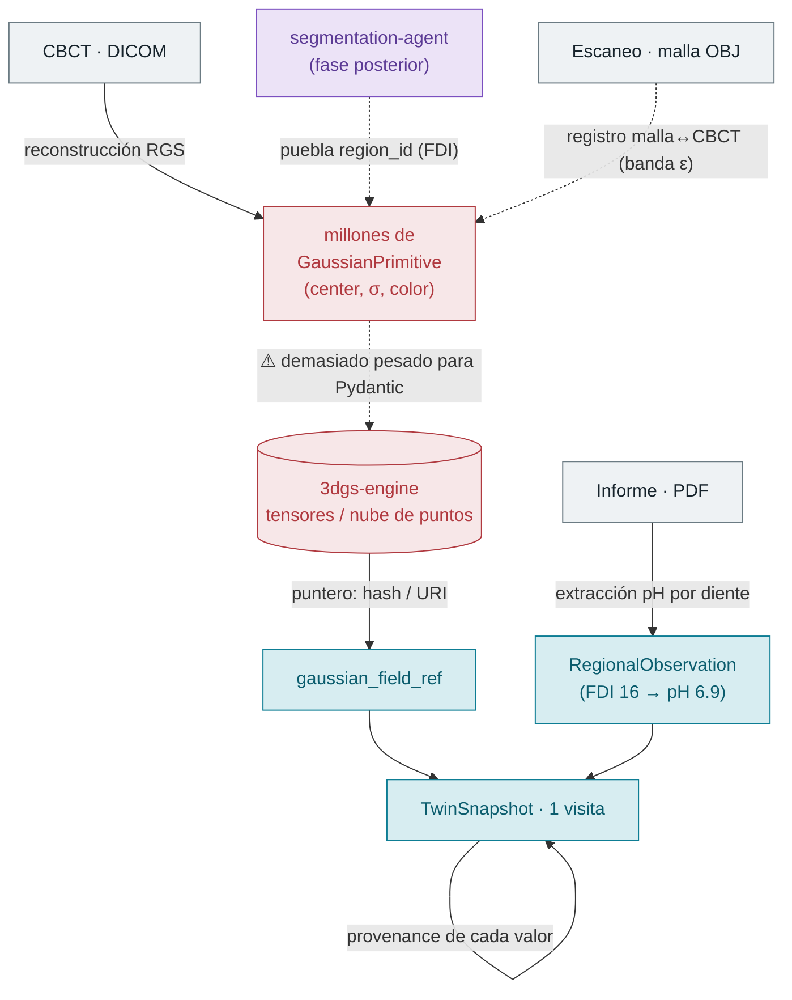
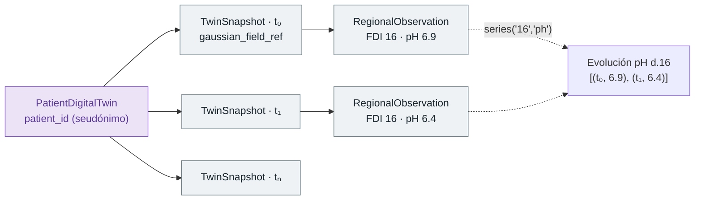
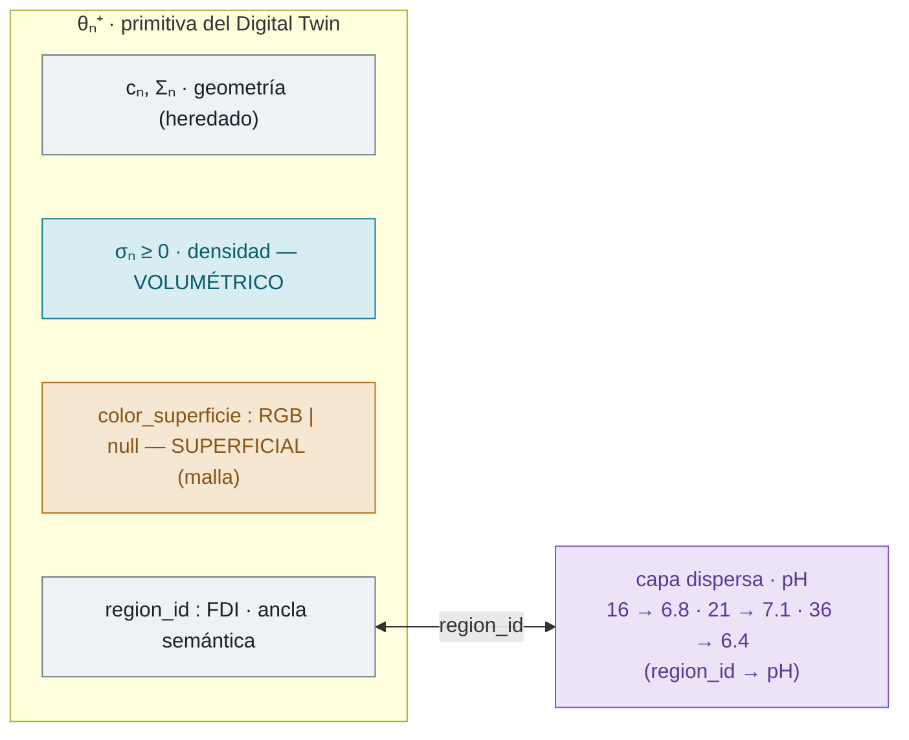

# ADR 001 — Contrato de datos del Digital Twin dental (`core-schemas`)

| | |
|---|---|
| **Estado** | Aceptado |
| **Fecha** | 2026-07-13 (rev. 2026-07-17) |
| **Decisor** | Equipo de desarrollo — Agentic Smart Health |
| **Ámbito** | Semana 1 · Tarea 1 (contratos de datos para la ingesta) |
| **Implementación** | [`packages/core-schemas/src/core_schemas/models.py`](../../packages/core-schemas/src/core_schemas/models.py) |
| **Relacionado** | Estudio físico/formato: [`3dgs-clinical-extension`](../research/3dgs-clinical-extension.md) · Registro de agentes: [`AGENTS.md`](../../AGENTS.md) |

> Un ADR registra **por qué** se tomó una decisión, no solo **qué** se implementó.
> Este documento explica el problema, el flujo de datos y las alternativas
> descartadas; el *qué* exacto (campos y tipos) vive en `models.py`.

---

## 1. Contexto y problema

### 1.1 La escena real

Un paciente entra a la clínica y se le mide con **dispositivos distintos**, y cada
uno produce un dato de **naturaleza geométrica diferente**:

| Aparato | Fichero | Aporta | ¿Dónde tiene sentido ese dato? |
|---|---|---|---|
| CBCT (escáner 3D de rayos X) | DICOM | **densidad** radiológica (σ) | en **todo el volumen** |
| Escáner intraoral | malla intraoral (OBJ/PLY) | **color** de superficie | solo en la **cáscara** |
| Informe clínico | PDF | **pH** (y otros) por diente | un valor **por región** |

Los tres describen **la misma boca**, pero no "viven" en el mismo lugar
geométrico. A esa propiedad la llamamos **soporte geométrico**, y es la idea
central del diseño:

| Dato | Soporte | Analogía |
|---|---|---|
| Densidad (σ) | **Volumétrico** — un valor en cada punto 3D | La temperatura *dentro* de una piscina |
| Color | **Superficial** — solo en la cáscara 2-manifold | La pintura de una pared: solo existe en la superficie |
| pH | **Regional** — un valor por diente | "La habitación 16 está a 20 °C": uno por zona, no por punto |

### 1.2 Por qué un modelo plano no sirve

La trampa es creer que basta con "añadir dos campos a la gaussiana". No sirve
porque las **granularidades son incompatibles**: hay *millones* de valores de
densidad (uno por gaussiana), color solo en la fina banda de la superficie, y
~32 valores de pH (uno por diente). Mezclarlos en un único modelo obliga a
repetir el pH en cada punto y a inventar densidad donde no la hay.

Además, el sistema debe soportar:

1. **Ingesta multimodal** (DICOM, malla OBJ, PDF) hacia el monorepo.
2. **Series temporales** para evaluar la evolución clínica.
3. **Trazabilidad** completa (RGPD/HIPAA): qué se ingirió, con qué transformación.
4. **Integración con 3DGS** sin cargar millones de gaussianas en memoria.

---

## 2. El flujo de datos: cómo se llena el contrato

Una **visita** produce ficheros que se transforman en la estructura del twin.
Fíjate en la **asimetría deliberada**: lo masivo (gaussianas) se *referencia*, lo
disperso (pH) se *guarda*.

- La **geometría/densidad masiva** → *no* se embebe: `TwinSnapshot.gaussian_field_ref`
  guarda solo un puntero (hash/URI) al almacén de `3dgs-engine`.
- El **pH** (pocos valores) → *sí* se guarda dentro del snapshot como lista de
  `RegionalObservation`.
- El **color** solo aplica a las gaussianas que caen en la banda ε de la
  superficie tras registrar la malla contra el volumen (de ahí `Color | None`).
- El **`region_id` (FDI)** *no* nace en la reconstrucción RGS: lo **puebla la fase
  de segmentación** (pipeline §6, fase 3), no la ingesta. El diagrama lo muestra
  como paso posterior (`segmentation-agent -.-> region_id`) para no dar a entender
  que el ancla semántica viene "gratis" con el volumen. El *origen* concreto de las
  etiquetas (manual / segmentación / DentalGS) sigue abierto (pipeline §3).

---

## 3. La dimensión temporal: el twin es una PELÍCULA, no una FOTO

`PatientDigitalTwin` **no** es un modelo 3D que va mutando. Es una **secuencia de
fotos (snapshots)**, una por visita. Cada snapshot es **autocontenido**.

Esto habilita dos consultas, ambas implementadas como métodos del modelo:

- `twin.latest()` → el snapshot más reciente (estado actual).
- `twin.series(region_id, attribute)` → recorre todos los snapshots y reúne el
  valor de esa región FDI en el tiempo. **Esta consulta es la Tarea 3** (evaluar
  la evolución clínica); el diseño temporal existe para poder hacerla.

---

## 4. Decisiones

### 4.1 Tres soportes geométricos, codificados estructuralmente

Los atributos **no comparten soporte** y por eso viven en modelos distintos:

| Atributo | Soporte | Vive en | Densidad de datos |
|---|---|---|---|
| Densidad σ | Volumétrico | `GaussianPrimitive.density` | denso · por gaussiana |
| Color | Superficial | `GaussianPrimitive.color_superficie` | solo banda ε · `\| None` |
| pH y otros | Regional | `ClinicalAttributes` (vía `RegionalObservation`) | disperso · 1/región |

> **Nota honesta de implementación:** el soporte se codifica *estructuralmente*
> (según en qué modelo vive el atributo), **no** como un campo etiqueta. El enum
> `Support` es **vocabulario controlado** para documentación y metadatos, no una
> restricción validada en los modelos. Se mantiene porque nombra explícitamente la
> decisión y será útil cuando los agentes de ingesta declaren qué soporte producen.
> Tensión conocida: el color es conceptualmente "superficial" pero se almacena
> *por gaussiana* (en el contenedor volumétrico), porque tras el registro malla↔CBCT
> son las gaussianas de la cáscara las que reciben el RGB.

### 4.2 Campo gaussiano referenciado, no embebido

`gaussian_field_ref: str` guarda un hash/URI; los tensores viven en `3dgs-engine`.
**Razón:** millones de objetos Pydantic serían inviables en memoria y lentos de
(de)serializar. El contrato define la *unidad canónica* (`GaussianPrimitive`) para
serializar conjuntos pequeños, no para almacenar el campo completo.

> **Invariante *fail-loud* (referencia colgante).** Un `TwinSnapshot` JSON válido
> puede apuntar a un hash que no existe en `3dgs-engine` (blob nunca subido o
> borrado). Al **cargar o exportar** hay que **validar que el blob existe** y
> abortar ruidosamente si no; nunca renderizar un modelo vacío en silencio. La
> política de ciclo de vida del blob (retención, GC) queda pendiente, pero el
> chequeo de existencia es obligatorio desde ya.

### 4.3 Enfoque snapshot-céntrico (reversibilidad)

Cada `TwinSnapshot` es autocontenido: su propio `gaussian_field_ref`, sus
modalidades y sus observaciones. **Razón: reversibilidad** — para regenerar el
la malla/imágenes de una fecha concreta basta con ese snapshot. Frente a mutar un único
twin (que perdería el historial), las fotos inmutables preservan el pasado.

### 4.4 `PatientDigitalTwin` como secuencia temporal

El gemelo es una línea temporal de estados, no un modelo continuo. Soporta
directamente la evaluación de evolución clínica (§3).

### 4.5 Trazabilidad granular (`Provenance` por observación)

`Provenance` se adjunta a cada `RegionalObservation`, **no** al snapshot completo.
Permite responder: *"¿de qué fichero, qué agente y con qué confianza salió este pH
del diente 16?"* — la explicabilidad que exigen RGPD/HIPAA. `patient_id` es siempre
un **seudónimo**, nunca un identificador directo (soberanía del dato).

### 4.6 `region_id` (FDI) como ancla semántica

El código ISO-FDI es el **pegamento** que une las tres capas: una gaussiana
volumétrica (densidad), su color de superficie y su pH regional se relacionan
porque todos apuntan al mismo diente (p. ej. "16"). Sin ese código común serían
tres nubes de datos inconexas.

> **Pendiente — el ancla FDI es hoy un *single point of failure* semántico.** Todo
> el pegamento depende de que `region_id` sea correcto en las tres fuentes
> (segmentación geométrica, informe/PDF, numeración clínica) y **no hay validación
> cruzada**: `FDICode` valida el *formato* (`"36"` y `"46"` son ambos válidos), no
> que el diente sea el correcto. Un swap de OCR en `report-agent` (leer "36" por
> "46") colgaría el pH del diente equivocado **sin ningún error visible** — error
> clínico silencioso. Tampoco se representan los casos borde (diente ausente,
> supernumerario, prótesis/implante). La defensa —verificación cruzada
> independiente (¿coinciden los dientes de la segmentación con los del informe?) y
> un vocabulario para los casos borde— queda **abierta** (se explora, sin validar, en
> el borrador especulativo ADR 003); se deja aquí **nombrada** para no tratarla como
> resuelta.

### 4.7 Validación *fail-loud*

`FDICode` valida el patrón ISO-FDI (`^([1-4][1-8]|[5-8][1-5])$`: permanentes
11–48, temporales 51–85); `density ≥ 0`, `pH ∈ [0,14]`, RGB `0–255`, y
`ConfigDict(extra="forbid")` rechaza campos no previstos. Los datos mal formados se
rechazan en tiempo de validación, no aguas abajo.

### 4.8 Versión de contrato y manejo explícito de fallos de ingesta

Dos añadidos que hacen el snapshot **auto-descriptivo y honesto sobre lo que falta**:

- **`schema_version` (SemVer, constante `SCHEMA_VERSION`).** Cada `TwinSnapshot`
  declara bajo qué versión del contrato se escribió. **Razón:** evita snapshots
  "huérfanos" — un JSON persistido antes de un cambio de contrato (o del formato
  del campo gaussiano) se detecta por versión en vez de fallar de forma opaca aguas
  abajo. Es la contraparte del canal binario `.ply/.splat`, cuyo formato aún se fija
  en spike.
- **`ingestion: list[ModalityIngestion]` con `ModalityStatus` (`ok` / `missing` /
  `failed`).** El campo `modalities` solo lista las presentes; por sí solo, un
  snapshot al que le falta la malla es **indistinguible** de uno donde el `mesh-agent`
  falló. `ingestion` es el log autoritativo del borde de ingesta: el orquestador
  anota el resultado de cada modalidad (con `detail` si no fue `ok`). **Razón:** un
  snapshot parcial debe **declararse como parcial**, no llegar callado a exportación
  y visualización — requisito de un sistema clínico. La **política del orquestador**
  ante un fallo (abortar vs. continuar parcial vs. reintentar) es decisión de diseño
  aparte; el contrato solo garantiza que el estado quede **representado**.

---

## 5. Alternativas consideradas

| Alternativa | Idea | Veredicto |
|---|---|---|
| **A · Modelo monolítico** | un solo modelo con todos los atributos mezclados | ❌ No respeta la distinción de soportes; obliga a repetir/inventar valores |
| **B · Referencia por índices** | usar índices numéricos en vez de códigos FDI | ❌ Pierde semántica clínica y validación |
| **C · Campo gaussiano embebido** | almacenar todas las gaussianas en el modelo Pydantic | ❌ Inviable con millones de puntos (memoria/serialización) |
| **D · Serie por atributo** | cada campo lleva su propia lista `(t, valor)` | ❌ Bueno para graficar, malo para geometría cambiante y reversibilidad |
| **E · Híbrido (elegido)** | snapshots autocontenidos + observaciones regionales *timestamped* | ✅ Reversibilidad **y** evolución por atributo |

---

## 6. Consecuencias

**Positivas**
- Separación de responsabilidades clara (volumétrico / superficial / regional).
- Soporte nativo de series temporales y de la consulta de evolución.
- Trazabilidad **por observación** (fichero, agente, confianza) y seudonimización
  desde el contrato.
- Rendimiento: el campo masivo se referencia, no se carga.

**Negativas / costes asumidos**
- Mayor complejidad inicial que un modelo plano.
- **Acoplamiento operativo**: hay que mantener sincronizados `3dgs-engine`
  (tensores) y `core-schemas` (punteros) — si el almacén cambia el hash, el
  snapshot queda colgado. *Mitigado en parte:* §4.2 exige validar la existencia del
  blob al cargar/exportar (*fail-loud*); la política de ciclo de vida (GC, versionado
  de hash) sigue abierta.
- El registro malla↔CBCT (banda ε) es un prerequisito externo aún **no diseñado**
  (ver Tarea 2 / futuro ADR de fusión).
- El `Support` como enum no-validado es documentación, no garantía (§4.1).

**Contradicción que este ADR deja *nombrada y abierta* (sin resolver):**
- **Inmutabilidad vs. «enriquecimiento».** §4.3 usa la inmutabilidad del snapshot
  como argumento de reversibilidad, pero el pipeline dice que `pathology-agent` /
  `segmentation-agent` **enriquecen** el snapshot. Mutar contradice la inmutabilidad;
  crear un snapshot nuevo por enriquecimiento contradice «1 snapshot = 1 visita».
  La respuesta candidata (enriquecimientos como **eventos append-only**, base
  inmutable) → abierto (esbozada, sin validar, en el borrador especulativo
  [ADR 003](003-verification-fault-tolerance.md)).

---

## 7. Mapa diseño → código

Implementación en [`packages/core-schemas/src/core_schemas/models.py`](../../packages/core-schemas/src/core_schemas/models.py):

| Concepto del diseño | Clase Pydantic | Notas |
|---|---|---|
| Primitiva extendida θₙ⁺ | `GaussianPrimitive` | `density` (σ≥0) + `color_superficie` + `region_id` |
| Color de superficie | `Color` | RGB 0–255 |
| Atributos regionales | `ClinicalAttributes` | `ph` (0–14); extensible (movilidad, sondaje…) |
| Observación temporal | `RegionalObservation` | región + atributos + `timestamp` + `provenance` |
| Snapshot por visita | `TwinSnapshot` | `schema_version` + referencia al campo gaussiano; reversibilidad |
| Resultado de ingesta | `ModalityIngestion` | estado por modalidad (`ok`/`missing`/`failed`) + `detail` — fail-loud (§4.8) |
| Gemelo del paciente | `PatientDigitalTwin` | secuencia de snapshots + `series()` / `latest()` |
| Trazabilidad | `Provenance` | fichero, modalidad, agente, confianza (RGPD/HIPAA) |
| Vocabulario | `Modality`, `ModalityStatus`, `Support`, `FDICode` | enums + patrón ISO-FDI |

### 7.1 Fundamento físico de la densidad (por qué σ y no color)

En rayos X **no hay color ni oclusión**: el rayo atraviesa el cuerpo y el detector
mide la absorción acumulada (**ley de Beer-Lambert**). Lo que se reconstruye es el
coeficiente de atenuación `μ(x)`, que RGS aproxima como suma **aditiva** de
gaussianas: `μ(x) = Σᵢ σᵢ · G(x | cᵢ, Σᵢ)`. Por eso la primitiva del 3DGS
fotométrico se **re-significa**: la opacidad `α ∈ [0,1]` pasa a densidad `σ ≥ 0`
(no acotada) y los armónicos esféricos de color se **descartan** (la atenuación es
isótropa). El `color_superficie` reintroduce a propósito ese canal de apariencia,
pero solo en la cáscara, desde la malla intraoral.

---

## 8. Referencias

- Lin et al., *Residual Gaussian Splatting for Ultra Sparse-View CBCT
  Reconstruction*, arXiv:2604.27552v1 (2026).
- Estudio de formato y física: [`docs/research/3dgs-clinical-extension.md`](../research/3dgs-clinical-extension.md).
- Estándares: ISO 3950 (numeración dental FDI), DICOM; mallas 3D (OBJ/PLY).
- Principios de agentes y contratos: [`AGENTS.md`](../../AGENTS.md).
