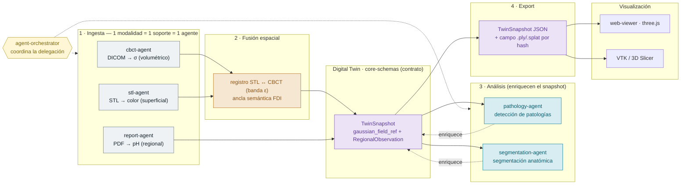
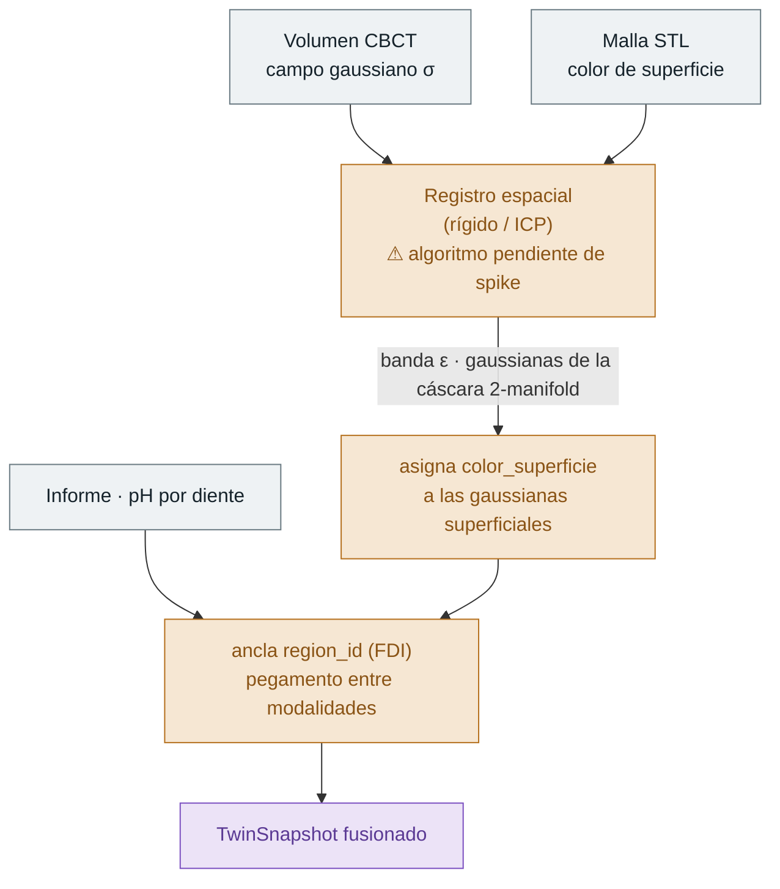
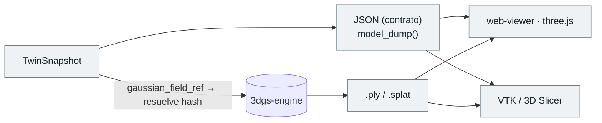

# Arquitectura del pipeline multiagente dental

| | |
|---|---|
| **Estado** | Aceptado (diseño de alto nivel) |
| **Fecha** | 2026-07-15 |
| **Decisor** | Equipo de desarrollo — Agentic Smart Health |
| **Ámbito** | Semana 1-2 · Diseño de la arquitectura multiagente del pipeline |
| **Relacionado** | Contrato de datos: [ADR 001](001-digital-twin-core-schemas.md) · Física/formato: [`3dgs-clinical-extension`](../research/3dgs-clinical-extension.md) · Registro de agentes: [`AGENTS.md`](../../AGENTS.md) |

> Este documento fija la **arquitectura de alto nivel y los flujos de delegación**
> del ecosistema multiagente. Es un entregable de **diseño**: esboza los
> mecanismos y **nombra explícitamente** las decisiones cuyo detalle depende de un
> PoC (spike). No implementa nada — el *qué* de los datos vive en
> [`core-schemas`](../../packages/core-schemas/), el *cómo* de cada pieza llegará
> con los MVP escalonados.

## 0. Vista de conjunto (para quien llega nuevo)

Si es tu primer contacto con el sistema, lee **solo esta sección**: te da el mapa
antes del detalle. El resto del documento formaliza cada pieza.

**La idea en una frase:** varios **agentes** (trabajadores con una única
responsabilidad) traducen ficheros clínicos heterogéneos a un **documento común**
(el `TwinSnapshot`), lo enriquecen y lo materializan para que un **visor** lo
muestre. Un **orquestador** reparte el trabajo.

**Las 6 capas** (de fuera hacia dentro):

| Capa | Qué es | Componente en el repo |
|---|---|---|
| **Visualización** | Lo que ve el usuario | `web-viewer` (three.js) · VTK / 3D Slicer |
| **Orquestación** | Reparte y ordena las tareas | `apps/agent-orchestrator` |
| **Agentes** | Hacen el trabajo (ingesta + análisis) | `cbct/stl/report/image-agent`, `segmentation/pathology-agent`… |
| **Cerebro (LLM)** | Razona **dentro** de un agente (no es una capa central; no todos lo usan) | Claude / Ollama — hoy solo en `research-agent` |
| **Contrato de datos** | El idioma común por el que se hablan los agentes | `packages/core-schemas` → `TwinSnapshot` |
| **Almacén pesado** | Guarda los millones de gaussianas (referenciadas por hash) | `packages/3dgs-engine` |

> **La confusión típica:** «el modelo» (el LLM) **no** es el sistema entero ni una
> capa aparte — es la *cabeza pensante* de un agente concreto. El agente es el
> empleado (rol + herramientas + permisos); el orquestador es el jefe; el
> `TwinSnapshot` es el documento que se pasan entre sí.

**El recorrido de un dato:**

```
Ficheros crudos (DICOM / STL / PDF / foto)
   │  [Agentes de INGESTA]        1 modalidad = 1 soporte = 1 agente
   ▼
TwinSnapshot  ──────────────►  core-schemas (idioma común); lo pesado → 3dgs-engine (por hash)
   │  [FUSIÓN espacial]           registro STL↔CBCT + ancla FDI
   ▼
TwinSnapshot fusionado
   │  [Agentes de ANÁLISIS]       enriquecen (segmentación, patología…) · Human-in-the-loop
   ▼
   │  [EXPORT]                     JSON del contrato + campo .ply/.splat
   ▼
Visores (web three.js / VTK)  ◄── lo que ve el usuario

  agent-orchestrator coordina todo el recorrido de principio a fin.
```

> **Dónde encaja lo construido hasta ahora:** el
> [PoC MVP 1](../../notebooks/README.md) (`notebooks/01-vtk-3dgs-poc.ipynb`) es un
> adelanto **manual** del tramo `stl-agent` → `3dgs-engine` → visor VTK — sin
> orquestador ni LLM todavía — para validar que las piezas encajan.

---

### Cobertura de la issue *Diseño de Arquitectura Multiagente (Semana 1-2)*

| # | Tarea | Dónde se resuelve | Estado |
|---|---|---|---|
| 1 | Contratos de datos de ingesta (DICOM, escaneos) | [ADR 001](001-digital-twin-core-schemas.md) + [§2](#2-tarea-1--contratos-de-ingesta) | ✅ (contrato cerrado; borde de ingesta definido) |
| 2 | Mecanismo de fusión (radiografía ↔ malla 3D/3DGS) | [§3](#3-tarea-2--mecanismo-de-fusión-espacial) | ✅ diseño esbozado · ⚠ algoritmo pendiente de spike |
| 3 | Roles de agentes de análisis + `AGENTS.md` | [§4](#4-tarea-3--agentes-de-análisis) + [`AGENTS.md`](../../AGENTS.md) | ✅ roles esbozados y registrados (stubs `planned`) |
| 4 | Formato y pipeline de exportación | [§5](#5-tarea-4--formato-y-pipeline-de-exportación) | ✅ diseño esbozado · ⚠ formato concreto pendiente de spike |
| 5 | Diagrama de arquitectura | [§1](#1-arquitectura-de-alto-nivel) | ✅ este documento |

> **Tres niveles, para evitar malentendidos.** Este documento **esboza el diseño**
> (nivel 1). Las decisiones irreversibles de detalle — el algoritmo exacto de
> fusión y el formato exacto de export — se **fijan tras el spike** (nivel 2). La
> **implementación** de la fusión multimodal completa es trabajo posterior, fuera
> de esta issue (nivel 3).

---

## 1. Arquitectura de alto nivel

El sistema es un pipeline por **fases**, coordinado por `agent-orchestrator`, donde
cada agente tiene **responsabilidad única** y se comunica con los demás
**exclusivamente a través del contrato de datos** de `core-schemas` (principio de
AGENTS.md). El `TwinSnapshot` es el punto de encuentro: los agentes de ingesta lo
**producen**, los de análisis lo **consumen y enriquecen**, y la capa de export lo
**materializa** para la visualización.



**Human-in-the-loop:** toda salida clínicamente sensible de la fase de análisis
requiere validación humana explícita antes de persistirse o exportarse (AGENTS.md).

---

## 2. Tarea 1 · Contratos de ingesta

El **contrato** de la ingesta ya está cerrado en el [ADR 001](001-digital-twin-core-schemas.md)
e implementado en [`core_schemas/models.py`](../../packages/core-schemas/src/core_schemas/models.py).
Lo que aquí se define es el **borde de ingesta**: quién produce qué, y bajo qué
regla de responsabilidad.

**Regla de diseño — «1 modalidad = 1 soporte = 1 agente».** Cada modalidad clínica
entra por un agente dedicado que la traduce al contrato, declarando su `Provenance`
(fichero, modalidad, agente, confianza). Esto mantiene la responsabilidad única y
hace la ingesta trazable extremo a extremo (RGPD/HIPAA).

| Agente de ingesta | Entrada (soporte físico) | `Modality` | Produce | Soporte geométrico |
|---|---|---|---|---|
| `cbct-agent` | DICOM (CBCT) | `cbct` | campo gaussiano σ → `gaussian_field_ref` | volumétrico |
| `stl-agent` | STL (escáner intraoral) | `stl` | `color_superficie` (tras fusión) | superficial |
| `report-agent` | PDF (informe clínico) | `report` | `RegionalObservation` (pH…) | regional |
| `image-agent` (PoC) | foto 2D | `image` | previsualización 3D básica | volumétrico |

> **Frontera raw → contrato.** Los agentes de ingesta son los **únicos** que tocan
> ficheros crudos. A partir del `TwinSnapshot`, ningún agente vuelve al fichero
> original: se opera solo sobre el contrato. El campo gaussiano masivo **no** se
> embebe — se referencia por hash/URI al almacén de [`3dgs-engine`](../../packages/3dgs-engine/)
> (ADR 001 §4.2).

---

## 3. Tarea 2 · Mecanismo de fusión espacial

**Problema.** El CBCT da un campo **volumétrico** (densidad σ) y el escáner
intraoral da una **malla superficial** (color). Están en **sistemas de coordenadas
distintos**: para que el color «pinte» las gaussianas correctas hay que **alinear
espacialmente** ambas geometrías. El informe (pH) no necesita alineación
geométrica: engancha por etiqueta de diente.

**Diseño esbozado (nivel 1):**



**Decisiones de diseño (fijadas):**

1. **Doble mecanismo de fusión según naturaleza del dato.**
   - *Geométrica* (CBCT ↔ STL): registro espacial. El color solo se asigna a las
     gaussianas dentro de una **banda ε** de la superficie registrada → de ahí
     `color_superficie: Color | None`.
   - *Semántica* (informe ↔ resto): no hay alineación geométrica; el `region_id`
     **FDI** actúa de **ancla** que une densidad, color y pH del mismo diente
     (ADR 001 §4.6). Las etiquetas FDI son el «pegamento» entre modalidades.
2. **La fusión produce un `TwinSnapshot`, no un modelo nuevo.** El resultado es
   contract-valid: se serializa al contrato existente, sin formato paralelo.
3. **Matemática del espacio 3D.** La alineación opera sobre rotación
   (**cuaterniones**, `GaussianPrimitive.rotation` = `(w, x, y, z)`) y traslación;
   el contrato ya reserva esos campos.

**Decisiones pendientes (nivel 2 — requieren spike):**

| Decisión abierta | De qué depende | Se resuelve en |
|---|---|---|
| Algoritmo de registro concreto (ICP, rígido, feature-based) | naturaleza real del dataset | PoC MVP 1 (VTK) → futuro ADR de fusión |
| Grosor de la banda ε | densidad del campo gaussiano | mismo spike |
| Origen de las etiquetas FDI (manual, segmentación, DentalGS) | [`segmentation-agent`](#4-tarea-3--agentes-de-análisis) | Tarea 3 |

> **Alcance honesto.** El registro STL↔CBCT era un prerequisito «aún no diseñado»
> en el ADR 001 §6. Este documento lo **esboza** (mecanismo, entradas, salida,
> ancla). La **implementación** de la fusión multimodal completa queda fuera de
> esta issue: se aborda tras validar que las librerías (VTK) tiran con el dataset.

---

## 4. Tarea 3 · Agentes de análisis

Los agentes de análisis **consumen** un `TwinSnapshot` fusionado y lo **enriquecen**
(nuevas observaciones, etiquetas, métricas), siempre a través del contrato y con
`Provenance` propia. Se registran como **stubs `planned`** en
[`AGENTS.md`](../../AGENTS.md) (fichas placeholder, sin implementación).

| Agente (stub) | Rol | Entrada → salida | Human-in-the-loop |
|---|---|---|---|
| `segmentation-agent` | Segmentación anatómica: asigna `region_id` (FDI) a las gaussianas | `TwinSnapshot` (sin etiquetas) → snapshot con `region_id` poblado | revisión si afecta a diagnóstico |
| `pathology-agent` | Detección de patologías a partir de densidad/color/geometría | `TwinSnapshot` → `RegionalObservation` con hallazgos | **sí** (decisión clínica sensible) |
| `clinical-poc-agent` (PoC) | Métrica visual básica: inflamación por color de encía y espacio encía-diente | `TwinSnapshot` → reporte de texto (log) | sí |

> `segmentation-agent` es **prerrequisito** de la fusión semántica (§3): sin
> etiquetas FDI, el ancla `region_id` no existe. Por eso en el pipeline la
> segmentación alimenta al resto.

---

## 5. Tarea 4 · Formato y pipeline de exportación

**Objetivo.** Materializar un `TwinSnapshot` para que lo consuman los
visualizadores (web y escritorio) sin acoplarlos al motor de generación.

**Diseño esbozado (nivel 1) — separación en dos canales**, coherente con la
asimetría del contrato (ADR 001 §2):

| Canal | Qué exporta | Formato (propuesto) | Consumidor |
|---|---|---|---|
| **Metadatos / contrato** | `TwinSnapshot` (referencias, `RegionalObservation`, provenance) | **JSON** (`model_dump` de Pydantic) | ambos visualizadores + API |
| **Campo gaussiano** | los tensores masivos referidos por `gaussian_field_ref` | **`.ply` / `.splat`** (por hash) | `web-viewer` (three.js), VTK/Slicer |



**Decisiones pendientes (nivel 2 — requieren spike):** el **formato binario
concreto** del campo gaussiano (`.ply` vs `.splat` vs formato VTK) depende de qué
motor de render se adopte. Se decide con el PoC del visor (three.js/GaussianSplats3D)
y el de VTK, y se registrará en el **futuro ADR de motor de render**. Hasta
entonces, el canal de metadatos (JSON del contrato) es estable y no bloquea.

---

## 6. Flujo de delegación (resumen)

1. **Ingesta** — `agent-orchestrator` dispara los agentes de ingesta; cada uno
   traduce su modalidad al contrato con `Provenance`.
2. **Segmentación** — `segmentation-agent` puebla `region_id` (FDI).
3. **Fusión** — registro espacial STL↔CBCT (banda ε) + ancla FDI → `TwinSnapshot`.
4. **Análisis** — `pathology-agent` y demás enriquecen el snapshot; los hallazgos
   clínicos pasan por **human-in-the-loop**.
5. **Export** — el snapshot se materializa (JSON + `.ply/.splat`).
6. **Visualización** — `web-viewer` (three.js) y/o VTK/Slicer lo renderizan.

Cada paso deja `Provenance` (qué dato, qué agente, qué transformación): la
**trazabilidad** exigida por el proyecto es una propiedad del pipeline, no un
añadido.

---

## 7. Decisiones abiertas (nivel 2 · pendientes de spike)

| # | Decisión | La informa | ADR destino |
|---|---|---|---|
| D1 | Motor de render (VTK-escritorio / three.js-web) | PoC MVP 1 (VTK) + PoC visor web | ADR 002 (render) |
| D2 | Algoritmo de registro espacial + banda ε | PoC MVP 1 sobre el dataset real | ADR de fusión |
| D3 | Formato binario del campo gaussiano (export) | depende de D1 | ADR de fusión/export |

Estas decisiones se dejan **nombradas y acotadas** a propósito: escribir el ADR
antes del spike sería adivinar. El diseño de esta issue las enmarca; los MVP
escalonados las cierran.

---

## 8. Referencias

- [ADR 001 — Contrato de datos del Digital Twin](001-digital-twin-core-schemas.md).
- [Extensión clínica del formato 3DGS](../research/3dgs-clinical-extension.md).
- [`AGENTS.md`](../../AGENTS.md) — registro y principios de los agentes.
- Estándares: ISO 3950 (numeración dental FDI), DICOM, STL.
