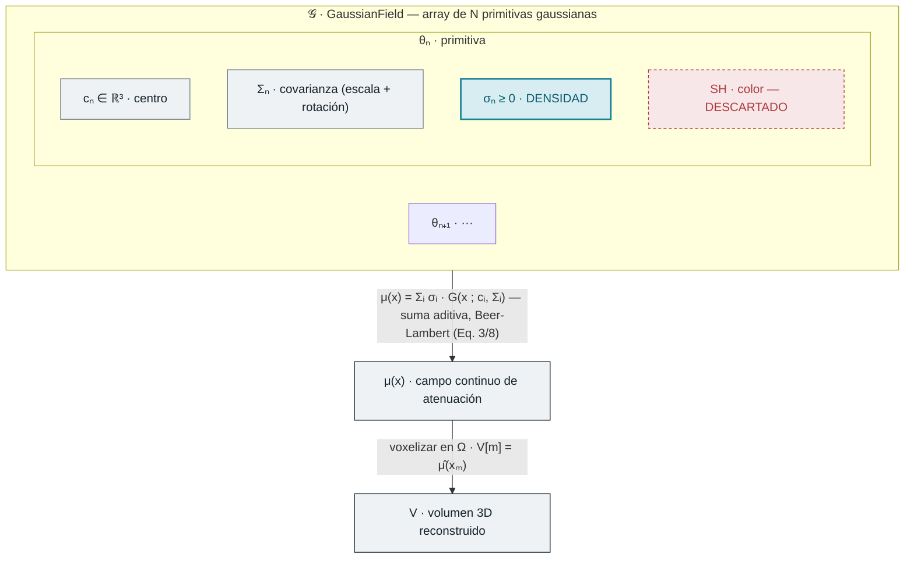
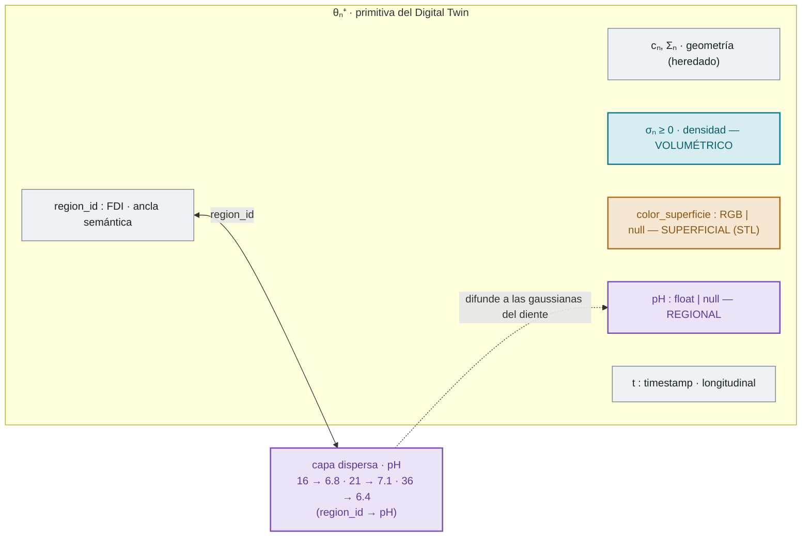
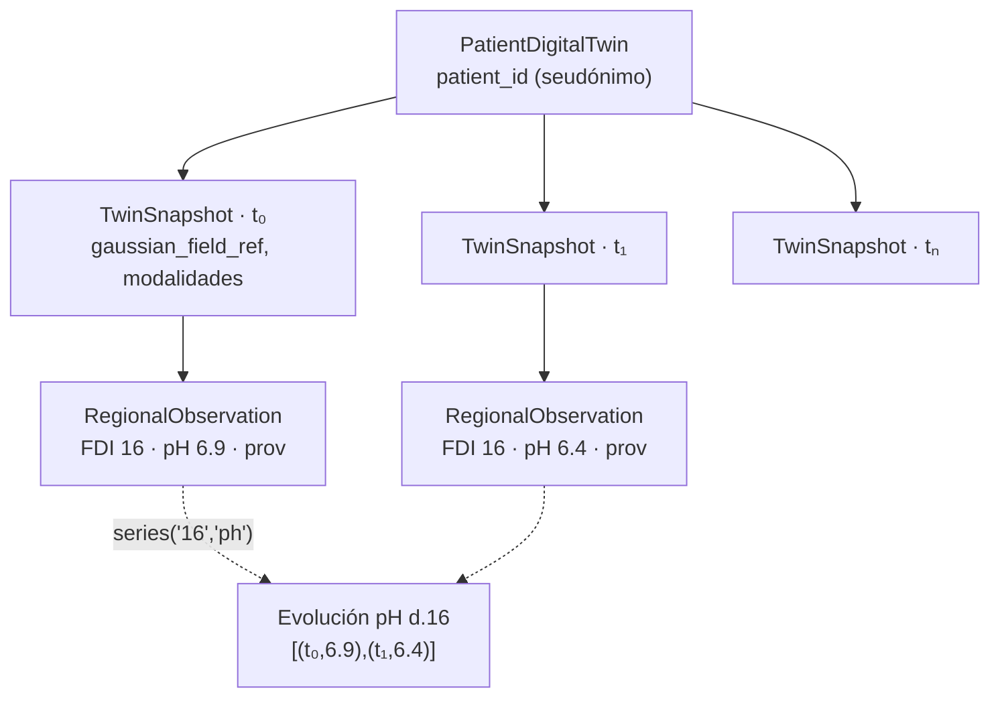

# Extensión clínica del formato 3DGS para el Digital Twin dental

> **Semana 1 — Fundamentos.** Estudio de la integración de datos médicos en el
> formato 3DGS y diseño de la estructura de datos Pydantic extendida para
> soportar metadatos clínicos y series temporales.
>
> Contraparte en código: [`core_schemas/models.py`](../../packages/core-schemas/src/core_schemas/models.py).
> Decisiones de diseño: [ADR 001](../architecture/001-digital-twin-core-schemas.md).

---

## 1. Cómo RGS guarda la densidad radiológica

**Paper analizado (Grupo 2 · CBCT + 3DGS):** Lin, Fang, Wang, Lai, Zhang, Chen, Liu,
*Residual Gaussian Splatting for Ultra Sparse-View CBCT Reconstruction*,
arXiv:2604.27552v1 (2026).

### La idea física

En rayos X **no hay color ni oclusión**: el rayo atraviesa el cuerpo y el detector
mide la absorción acumulada a lo largo de la línea (**ley de Beer-Lambert**, Eq. 1):

```
P(u,v,β) = ∫_L μ(x) dx
```

Lo que se reconstruye es `μ(x)`, el **coeficiente de atenuación lineal** — la
"densidad" radiológica. RGS la aproxima como una suma de gaussianas usadas como
funciones base continuas (Eq. 3):

```
μ(x) = Σᵢ σᵢ · G(x | cᵢ, Σᵢ)
```

### Re-significado atributo → atributo

RGS **reutiliza** la primitiva del 3DGS fotométrico cambiando su semántica:

| 3DGS estándar (luz visible) | → | RGS / CT (rayos X) | Por qué |
|---|---|---|---|
| Opacidad `α ∈ [0,1]` | → | **`σ ≥ 0`** (no acotada) | densidad física, estrictamente no-negativa |
| Color `SH` (view-dependent) | → | *descartado* | la atenuación es isótropa |
| Alpha-blending (multiplicativo) | → | integral de línea **aditiva** | Beer-Lambert: el rayo atraviesa, no ocluye |
| Centro `c`, covarianza `Σ` | → | sin cambios | la geometría de la primitiva se conserva |

**Conclusión clave:** la densidad no es un objeto aparte — **es el escalar `σₙ ≥ 0`
guardado en cada gaussiana** (`θₙ = {cₙ, Σₙ, σₙ}`, Eq. tras 8).

### Diagrama de bloques — estructura de datos de la densidad



> RGS inicializa esas gaussianas desacoplando frecuencias (DWT → rama base FDK +
> rama detalle por saliencia) y las optimiza en 2 fases (curriculum). Ese pipeline
> es *cómo se rellena* `σ`; para la estructura de datos, lo relevante es **dónde
> vive** la densidad.

---

## 2. Extensión clínica: `pH` y `color_superficie`

La trampa es creer que basta con "añadir dos campos". Los tres atributos **no viven
sobre el mismo soporte geométrico**, y esa es la decisión de diseño:

| Atributo | Origen | Soporte geométrico | Densidad de datos | Cómo se asigna |
|---|---|---|---|---|
| `σ` densidad | CBCT · DICOM | **Volumétrico** — todo el volumen | Denso · por gaussiana | Reconstrucción RGS |
| `color_superficie` | STL · malla | **Superficial** — cáscara 2-manifold | Solo gaussianas en banda ε | Registro STL ↔ CBCT |
| `pH` | Informe · PDF | **Regional** — por diente/zona | Disperso · 1 valor/región | Capa dispersa `region_id → pH` (FDI) |

**Decisiones:**

- **`color_superficie`** reintroduce a propósito un canal de apariencia superficial
  que RGS había *descartado* (los SH) por ser isótropa la atenuación. El CBCT no lo
  necesitaba; el Digital Twin sí. Requiere registrar el STL contra el volumen y solo
  aplica a las gaussianas de la cáscara → `Color | None`.
- **`pH`** no es por-punto sino por-zona. Modelo **híbrido**: lo volumétrico/superficial
  se embebe en la gaussiana; lo regional vive en una **capa dispersa** indexada por
  `region_id` (FDI), y las gaussianas la heredan. Las etiquetas FDI hacen de
  "pegamento" semántico entre modalidades.

### Diagrama de bloques — estructura extendida `θₙ⁺`



---

## 3. Soporte de series temporales

**Objetivo:** evaluar la evolución clínica del paciente a lo largo del tiempo.

Se evaluaron tres modelos:

| Opción | Idea | Veredicto |
|---|---|---|
| A · Snapshots por visita | cada adquisición = estado completo | reversible, pero sin serie por-atributo directa |
| B · Serie por atributo | cada campo lleva su lista `(t, valor)` | bueno para graficar, malo para geometría cambiante |
| **C · Híbrido (elegido)** | snapshots + observaciones regionales *timestamped* | reversibilidad **y** evolución de atributos |

**Modelo híbrido:** el gemelo es una secuencia de `TwinSnapshot` (uno por
visita/escaneo, autocontenido → **reversibilidad**: se puede regenerar STL/imágenes
de esa fecha). El campo gaussiano masivo no se embebe: se referencia por hash/URI al
almacén de `3dgs-engine`. Cada snapshot lleva sus `RegionalObservation` con
`timestamp`, de modo que **la evolución de un atributo** (p. ej. el pH del diente 16)
se obtiene reuniendo esa región a través de los snapshots.



`PatientDigitalTwin.series(region_id, attribute)` implementa esa consulta.

---

## 4. Traducción a `core-schemas/models.py`

| Concepto del diseño | Clase Pydantic | Notas |
|---|---|---|
| Primitiva `θₙ⁺` | `GaussianPrimitive` | `density` (σ≥0) + `color_superficie` + `region_id` |
| Color de superficie | `Color` | RGB 0–255 |
| Atributos regionales | `ClinicalAttributes` | `pH` (0–14); extensible |
| Observación temporal | `RegionalObservation` | región + atributos + `timestamp` + provenance |
| Snapshot por visita | `TwinSnapshot` | referencia al campo gaussiano; reversibilidad |
| Gemelo del paciente | `PatientDigitalTwin` | secuencia de snapshots + `series()`/`latest()` |
| Trazabilidad | `Provenance` | fichero, modalidad, agente, confianza (RGPD/HIPAA) |
| Vocabulario | `Modality`, `Support`, `FDICode` | enums + patrón ISO-FDI |

**Validaciones fail-loud** comprobadas: `σ < 0`, `pH ∉ [0,14]` y `FDICode`
inválido se rechazan en tiempo de validación.

> **Nota de escala:** los millones de gaussianas viven como tensores/nubes de puntos
> en `3dgs-engine`. `core-schemas` define el *contrato* de datos y los metadatos
> clínicos; `GaussianPrimitive` documenta la unidad canónica y sirve para
> (de)serializar conjuntos pequeños, no para almacenar el campo completo como
> objetos Pydantic.

---

## Referencias

- Lin et al., *Residual Gaussian Splatting for Ultra Sparse-View CBCT Reconstruction*, arXiv:2604.27552v1 (2026).
- Notas de los otros papers del Grupo 2: [`01_3dgs_usage/`](01_3dgs_usage/) (DentalGS aporta las etiquetas FDI como ancla semántica; NNTV-GS comparte la física Beer-Lambert con otro regularizador).
- Estándares: ISO 3950 (numeración dental FDI), DICOM, STL.
