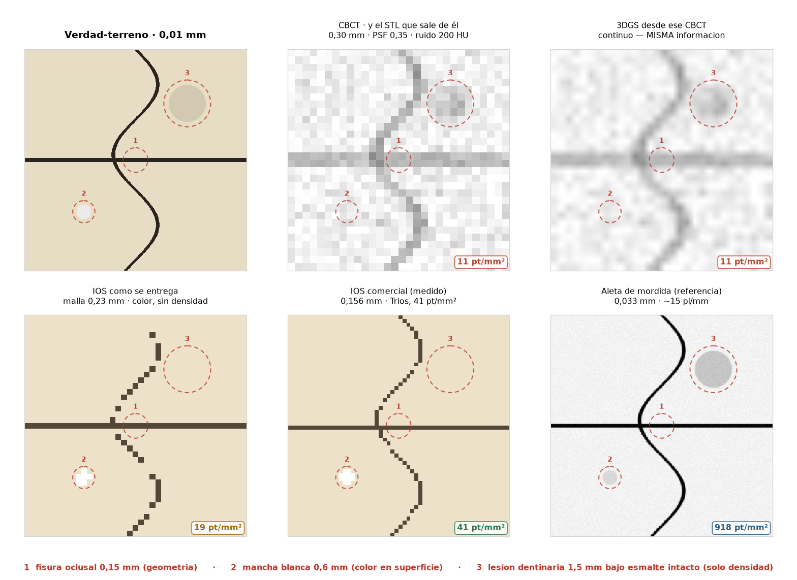
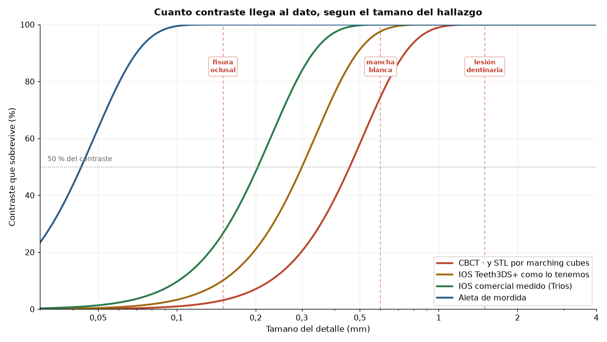

# Qué puede ver de verdad cada modalidad

**Pregunta.** ¿Cuánta resolución podemos obtener de CBCT, IOS y 3DGS, y por qué nos
es útil 3DGS si no la aumenta?

**Respuesta corta.** El poder resolutivo lo pone el dato, no la representación:
3DGS **no añade resolución** y no puede. Lo que aporta es repartir la capacidad
donde el dato la tiene, y eso solo compensa cuando las modalidades tienen
resoluciones distintas — que es exactamente nuestro caso.

Reproducible con `uv run python scripts/resolucion_modalidades.py`.
Versión visual: [`resolucion-modalidades.html`](resolucion-modalidades.html).

---

## 1. El montaje

Un parche de 9 × 9 mm de superficie oclusal con **tres hallazgos elegidos para que
cada uno viva en un soporte distinto** — la distinción que el contrato de
`core-schemas` ya codifica en su enum `Support`:

| | Hallazgo | Tamaño | Existe como |
|---|---|---|---|
| 1 | Fisura oclusal | 0,15 mm | geometría |
| 2 | Mancha blanca (caries incipiente) | 0,60 mm | color en superficie |
| 3 | Lesión dentinaria bajo esmalte intacto | 1,50 mm | solo densidad |

Cada modalidad se simula con su cadena física: **PSF gaussiana → muestreo a su paso
→ ruido**.

## 2. Qué resolución tiene el CBCT de verdad

Medido sobre el CBCT de `data/raw/histora`: un **Carestream CS 9600**, 578 cortes de
535 × 535, vóxel 0,30 mm isótropo, 120 kVp, 5 mA. La PSF sale de ajustar una función
error a ~800 perfiles perpendiculares a bordes de alto contraste; el ruido, de la
desviación robusta entre vóxeles vecinos en tejido homogéneo.

| | mm | µm | pl/mm |
|---|---|---|---|
| **Muestrea** (vóxel) | 0,300 | 300 | 1,67 |
| **Resuelve** · tejido↔hueso | **0,425** | **425** | **1,18** |
| Resuelve · aire↔esmalte | 0,567 | 567 | 0,88 |
| Resuelve · metal | 0,611 | 611 | 0,82 |

**Vóxel y resolución no son lo mismo.** El vóxel es el paso de muestreo, que se elige
al reconstruir; la FWHM es lo que la óptica puede separar. Aquí la resolución real es
**1,42× más gruesa que el vóxel**: el equipo escribe más muestras de las que mide.

Eso no es un defecto — muestrear justo en el límite de Nyquist produce *aliasing*, y
un margen del 40 % lo evita. Lo que no se puede es leer el vóxel como si fuera la
resolución, que es el error más común al hablar de estos equipos.

**Y resuelve peor cuanto más contraste tiene el borde.** La PSF geométrica no depende
del contraste, así que ese empeoramiento —de 425 µm en hueso a 567 µm en esmalte— no
es óptica sino **endurecimiento del haz**. La consecuencia clínica es incómoda: el
equipo pierde precisión justo en los bordes del esmalte, que es donde más interesaría
medirla. Por eso se toma la ventana de bajo contraste como PSF del sistema: las otras
dos llevan artefacto dentro.

**Ruido medido:** 14,7 HU en tejido blando y 47,2 HU en hueso trabecular. Se usa el
segundo porque es el tejido que rodea a los dientes. El primero es un **límite
inferior**: si la reconstrucción aplica reducción de ruido —y un CS 9600 moderno
seguramente lo hace— el ruido queda correlacionado entre vóxeles y un estimador por
diferencias lo subestima.

## 3. Lo que enseña el panel de 3DGS

Es el resultado central. El panel de «3DGS desde ese CBCT» sale **suave, sin
escalones y visualmente mejor** que el del CBCT — y contiene **exactamente la misma
información**: los mismos 11 puntos por mm², interpolados. Ni un hallazgo más.

Es la demostración de que **suavidad no es información**, y es la respuesta cuando
alguien pregunte si con Gaussian Splatting se vería mejor una caries.

Concuerda con lo ya medido en [`3dgs-volumetrico-cbct.md`](3dgs-volumetrico-cbct.md)
§3 de esa ficha: doblar la resolución de render de 400 a 800 px **no mejora** la rama volumétrica
(43,1 dB en ambas) y **empeora** la fotométrica en 1,3 dB.

## 4. Contraste que sobrevive, por modalidad

| Modalidad | Muestreo | pt/mm² | 0,15 mm | 0,30 mm | 0,60 mm | 1,00 mm |
|---|---|---|---|---|---|---|
| CBCT · y el STL que sale de él | 0,300 mm | 11 | 2 % | 12 % | 57 % | 95 % |
| IOS Teeth3DS+ como lo tenemos | 0,230 mm | 19 | 10 % | 50 % | 98 % | 100 % |
| IOS comercial medido (Trios) | 0,156 mm | 41 | 27 % | 84 % | 100 % | 100 % |
| Aleta de mordida | 0,033 mm | 918 | 100 % | 100 % | 100 % | 100 % |

Retener contraste es condición **necesaria, no suficiente**: aún hay que superar el
ruido.

## 5. Cuántos puntos da cada una

La otra mitad de la pregunta: no qué detalle sobrevive, sino **cuántos datos hay**.
En píxeles, que es la unidad que sí se intuye — si desenrollaras la superficie y la
guardaras como imagen:

| | Paso | pt/mm² | ×CBCT | Cara oclusal (9×9 mm) | Arcada entera | MP | Resuelve |
|---|---|---|---|---|---|---|---|
| **Miden** | | | | | | | |
| CBCT | 0,300 mm | 11 | 1× | **30 × 30 px** | 258 × 258 px | 0,07 | **0,425 mm** |
| **STL por marching cubes desde el CBCT** | 0,306 mm | **17,7** | 1,6× | 38 × 38 px | 326 × 326 px | 0,11 | 0,425 mm |
| IOS Teeth3DS+ como lo tenemos | 0,230 mm | 19 | 2× | 39 × 39 px | 337 × 337 px | 0,11 | 0,23 mm |
| IOS comercial medido (Trios) | 0,156 mm | 41 | 4× | 58 × 58 px | 497 × 497 px | 0,25 | 0,16 mm |
| Aleta de mordida | 0,033 mm | 918 | 83× | 273 × 273 px | 2347 × 2347 px | 5,51 | 0,03 mm |
| **Hereda** | | | | | | | |
| 3DGS · hoy, sembrado del CBCT | *0,300 mm* | *11* | *1×* | *30 × 30 px* | *258 × 258 px* | *0,07* | *0,425 mm* |
| 3DGS · tras fusionar la malla | *0,156 mm* | *41* | *4×* | *58 × 58 px* | *497 × 497 px* | *0,25* | *0,16 mm* |

Las dos últimas filas van **en cursiva y separadas** a propósito: 3DGS no mide nada,
así que esas cifras no son suyas — son las de la fuente con la que se le entrena. Es
la diferencia entre un instrumento y un envase.

Una **arcada entera** vista por el CBCT son 0,067 MP: cuatro veces menos que una
miniatura de WhatsApp, 720 veces menos que una foto de móvil. Y una cara oclusal de
molar son **30 × 30 píxeles**, un icono.

**Crece con el cuadrado del paso.** Afinar a la mitad multiplica los puntos por
cuatro; de 0,156 a 0,033 mm hay 4,7× de paso pero **22× de puntos**. En la cuenta de
la §10 el exponente es tres, no dos, y por eso allí los números explotan.

| Salto entre escalones consecutivos | Puntos | Resolución |
|---|---|---|
| CBCT / STL → IOS Teeth3DS+ | 1,7× | 1,5× |
| IOS Teeth3DS+ → IOS comercial | 2,2× | 1,5× |
| **IOS comercial → aleta de mordida** | **22,3×** | **4,7×** |

Y aquí está el resultado que no esperaba: **las tres modalidades 3D están agrupadas
entre 11 y 41 pt/mm²**, dentro de un factor de 4. El salto de verdad —22×— es hacia
la **aleta de mordida**, que es una radiografía plana de toda la vida.

Dicho de otro modo: en densidad de puntos sobre una superficie, CBCT, STL y escáner
intraoral **juegan todos en la misma liga**. Lo que cambia radicalmente entre ellos
no es cuántos puntos dan, sino **qué miden**: geometría, densidad o color.

### Qué significan las dos filas de 3DGS

**Hoy** el campo se siembra del CBCT: una gaussiana por vóxel ocupado, 127 037
primitivas. **Tras fusionar** la malla, la banda ε toma el detalle del escáner y la
cáscara sube a su resolución — que es el diseño del `geometric-fusion-agent`.

Y en los dos casos, **133 capas más hacia dentro** que ninguna malla de superficie
posee: el CBCT de una arcada de 40 mm a 0,30 mm son ~8,9 millones de vóxeles en
total, aunque sobre cualquier superficie concreta solo caigan 66 667.

Dicho en la unidad que se entiende: **el escáner es una foto de 0,25 MP de la
cáscara; el CBCT es un icono de 0,07 MP repetido 133 veces hacia dentro.** En puntos
de superficie apenas se llevan 3,5×, y sin embargo son cosas radicalmente distintas
— porque uno tiene color y el otro profundidad. El campo gaussiano es el único
formato de esta ficha que puede llevar las dos a la vez.

⚠️ **Pero hoy no las lleva.** El campo actual está a resolución de CBCT y la fusión
geométrica todavía no ha densificado la cáscara: de implementación, no de método —
pero está ahí.

## 6. El STL que sale del CBCT (marching cubes)

Marching cubes coloca los vértices sobre las **aristas de la rejilla**, así que la
distancia entre puntos del STL *es* el vóxel del CBCT. Medido sobre el volumen real
de `histora` (recorte de arcada, 42 × 90 × 90 mm, isovalor 1200 HU):

| Vóxel | Vértices | Área | Arista mediana | pt/mm² |
|---|---|---|---|---|
| 0,60 mm | 25 539 | 5 741 mm² | **0,610 mm** | 4,4 |
| **0,30 mm** (nativo) | **131 479** | **7 433 mm²** | **0,306 mm** | **17,7** |
| 0,15 mm (rejilla sobremuestreada ×2) | 462 781 | 6 938 mm² | **0,154 mm** | 66,7 |

La arista sigue al vóxel con una fidelidad que no admite discusión. En el fantoma
sintético sale igual a cuatro resoluciones (0,400 / 0,300 / 0,200 / 0,100 mm).

**Matiz de densidad:** aunque la arista sea el vóxel, los puntos **no** caen en una
rejilla cuadrada —los vértices viven en las aristas del cubo—, así que la densidad
real es ~1,6× la de `1/v²`: **17,7 pt/mm²** medidos frente a los 11 que daría la
cuenta ingenua.

**Y aquí está el resultado que zanja la tarea 2.** Sobremuestrear la rejijla a la
mitad del vóxel da **3,5× más vértices** — de 131 k a 463 k — mientras la resolución
del equipo sigue siendo **425 µm**, medida en la §2. Esos 463 000 vértices describen
**interpolación, no medida**. Un STL denso sacado de un CBCT es una malla suave, no
una malla precisa, y es el error que cometería quien intente cumplir el presupuesto
de 0,1 mm subiendo la resolución de reconstrucción.

### Por qué el área extraída no es constante

Con dato real, el área depende de la resolución: 7 433 mm² a 0,30 mm frente a 5 741 a
0,60. En el fantoma sintético se mantenía plana. **Mi primera explicación —que era el
ruido— resultó falsa**, y el control lo dice sin ambigüedad: inyectar al fantoma el
ruido medido de 47 HU infla su área **1,00×**. Ni con 100 HU pasa de 1,04×.

Lo que manda es el **gradiente en la isosuperficie**:

| Isovalor | Qué separa | Área cruda | Tras suavizar | Cae a | Dimensión | \|grad\| |
|---|---|---|---|---|---|---|
| −500 | aire ↔ piel | 12 274 mm² | 8 049 | 66 % | 2,23 | 27 HU/vóxel |
| 300 | tejido ↔ hueso | **50 210 mm²** | 26 266 | 52 % | **2,44** | 80 |
| 1200 | hueso ↔ cortical | 7 433 mm² | 3 531 | 48 % | 2,45 | 60 |
| **2000** | **esmalte** | **2 200 mm²** | 1 836 | **83 %** | **2,10** | **364** |

**Es la paradoja de la costa.** Una isosuperficie que cruza un borde nítido —el
esmalte, con 364 HU/vóxel de gradiente— está bien definida: dimensión 2,10, casi una
superficie lisa, y su área apenas cambia al medirla a otra escala. Una que atraviesa
una **textura** —el hueso trabecular, 60–80 HU/vóxel— es fractal: dimensión 2,45, y
su área **no existe** como magnitud, depende de con qué regla la midas.

El caso de 300 HU lo enseña de golpe: **50 210 mm², veinte veces la superficie del
esmalte**, porque la isosuperficie se pasea por toda la trabécula.

**La regla práctica, y afecta al `export-agent`:** solo tiene sentido extraer malla
donde el gradiente sea fuerte. El esmalte se puede mallar y medir; el hueso
trabecular no — y el umbral de 300 HU que usa hoy el `cbct-agent` para sembrar
gaussianas es justo el peor isovalor posible si algún día se usa para mallar.

Y tiene consecuencias para la métrica del brief: **«error de malla < 0,1 mm» solo
está bien definido sobre superficies de gradiente alto.** Sobre hueso trabecular la
pregunta no tiene respuesta, porque no hay una superficie única que aproximar.

### La comparación que mejor resume todo

| | pt/mm² | Resolución |
|---|---|---|
| STL desde el CBCT | 17,7 | **425 µm** |
| Escáner intraoral de `histora` | 25 | **~200 µm** |

**Densidades de punto casi iguales, resolución que difiere en más del doble.** Es la
demostración más limpia de que contar puntos no mide información.

## 7. Qué resolución dan los escáneres intraorales de verdad

Medido sobre arcada completa, con la misma definición que usamos aquí (número de
puntos ÷ superficie):

| Escáner | Resolución | Paso | Trueness | Precisión |
|---|---|---|---|---|
| Omnicam | 79,82 pt/mm² | 0,112 mm | 98,3 µm | ±261,8 µm |
| True Definition | 54,68 pt/mm² | 0,135 mm | 32,1 µm | ±98,8 µm |
| Trios | 41,21 pt/mm² | 0,156 mm | 55,3 µm | ±194,5 µm |
| iTero | 34,20 pt/mm² | 0,171 mm | 94,5 µm | ±246,8 µm |

Y *in vivo* sobre cinco escáneres: trueness **76,6 ± 79,3 µm**, precisión
**56,6 ± 52,4 µm**.

**Tres magnitudes que se confunden constantemente**, y conviene no mezclarlas:

| Magnitud | Qué es | Valor |
|---|---|---|
| Muestreo | cada cuánto hay un punto | 34–80 pt/mm² → 0,11–0,17 mm |
| Trueness | cuánto se desvía de la verdad | 32–98 µm |
| Precisión | cuánto varía entre escaneos | 56–262 µm |

Dos consecuencias:

- **La trueness de Trios (55 µm) es tres veces mejor que su paso entre puntos
  (156 µm).** Otra vez localizar frente a resolver: la superficie se conoce mejor de
  lo que sugiere la densidad de la malla.
- **No hay correlación significativa entre resolución y exactitud** en tres de los
  cuatro escáneres. Más puntos **no** dan mejor medida — nuestra tesis, confirmada de
  forma independiente por gente que no intentaba demostrarla.

Y sobre nuestros datos: Teeth3DS+ da **19 pt/mm²**, más basto que los cuatro
escáneres comerciales. Esas mallas están diezmadas, así que el 0,23 mm es una
propiedad del dataset, no del aparato.

Fuentes: [Nedelcu et al., resolución y exactitud de cuatro escáneres](https://pmc.ncbi.nlm.nih.gov/articles/PMC5937957/) ·
[exactitud in vivo de cinco escáneres](https://pmc.ncbi.nlm.nih.gov/articles/PMC7940805/)

## 8. Las dos fronteras, que no son la misma

Aquí está la respuesta a «cómo se mide la calidad de un CBCT»: no es un número,
son cuatro ejes que se miden con fantomas distintos, y **fallan en regímenes
distintos**.

- Un detalle de **1 mm conserva el 95 %** de su contraste: 663 HU sobre un ruido
  medido de 47 HU dan **CNR 14**, muy por encima del umbral de Rose. Se ve.
- Un detalle de **0,15 mm conserva el 2 %**: 5 HU, **CNR 0,1**. **Falla la
  resolución**, y no hay dosis que lo arregle — la información se perdió al
  emborronarse.

La frontera entre ambos regímenes cae alrededor de **0,6 mm**, donde el CNR baja
a 6 y la detección pasa a depender del caso.

Con los supuestos que teníamos antes de medir (ruido 200 HU) la lesión de 1 mm salía
como no detectable. **El equipo real es cuatro veces más silencioso**, así que ve
bastante más de lo que la simulación anticipaba: la frontera de detección baja de
~1,5 mm a ~0,6 mm. Lo que no cambia es el otro lado — por debajo de 0,3 mm sigue sin
haber nada que hacer.

Corolario clínico, que conviene decirle al partner: **que algo no salga en la imagen
no significa que no esté.** Una cortical más fina que la resolución desaparece del
reconstruido y se lee como dehiscencia.

## 9. Dos hallazgos laterales

**El aliasing depende de la orientación.** A 0,23 mm —el muestreo real de nuestras
mallas— la fisura de 0,15 mm se rompe en trozos inconexos, pero su tramo recto, que
cae alineado con la rejilla, sale entero. El mismo detalle se representa o se pierde
según cómo esté girado.

**Ninguna modalidad de superficie ve la lesión dentinaria**, por fina que sea. No es
resolución: está bajo esmalte intacto y un escáner óptico no lo atraviesa. Es la
justificación más limpia de por qué el gemelo necesita las dos ramas.

## 10. Entonces, por qué 3DGS

No por resolución. Por **asignación adaptativa de capacidad**: fino en la superficie
que mide el escáner, basto en el interior que solo mide el CBCT. Una rejilla de
vóxeles está obligada a elegir una única resolución para todo el volumen.

Coste de representación a fidelidad equivalente (arcada de 70 × 55 × 40 mm,
superficie 6000 mm², ocupación 20 %, interior siempre a 0,30 mm):

| Fidelidad de superficie | Rejilla uniforme | Rejilla dispersa | Campo adaptativo | Ventaja |
|---|---|---|---|---|
| 0,10 mm — presupuesto del brief | 154,0 M | 30,8 M | 1,74 M | **17,7×** |
| 0,156 mm — IOS comercial medido | 40,6 M | 8,1 M | 1,39 M | 5,8× |
| 0,23 mm — nuestras mallas Teeth3DS+ | 12,7 M | 2,5 M | 1,25 M | 2,0× |
| 0,30 mm — resolución del CBCT | 5,7 M | 1,1 M | 1,21 M | **0,9×** |

**La ventaja es del requisito, no de la representación.** A resolución de CBCT el
campo gaussiano *pierde* contra una rejilla dispersa. Toda la ganancia aparece al
exigir detalle de superficie más fino que el vóxel, y el cruce está en ≈ 0,25 mm.

Dos consecuencias incómodas y honestas:

- **Nuestros datos no ejercitan hoy esa ventaja.** Las mallas de Teeth3DS+ muestrean
  a ~0,23 mm, casi igual de basto que el CBCT, y ahí la ventaja es 2×. Ni siquiera
  con un escáner comercial (0,156 mm) pasa de 5,8×.
- **Estamos 14× por debajo.** El `cbct-agent` produce hoy 127 037 primitivas
  (resolución de CBCT, una gaussiana por vóxel ocupado); honrar el presupuesto de
  0,1 mm pediría ~1,74 M.
- **Y el 17,7× depende del presupuesto del brief, no de ningún aparato.** Ningún
  escáner del mercado entrega 0,1 mm de muestreo: el requisito es de *exactitud*
  (trueness 32–98 µm), que es otra magnitud.

**Objeción que hay que anticipar:** un octree o hash-grid multirresolución capturaría
buena parte de esta ventaja. Lo que gana es la **adaptividad**, no «gaussianas». Lo
que las gaussianas añaden por encima son las otras dos propiedades del
[ADR 001](../architecture/001-digital-twin-core-schemas.md): **tres soportes en un
mismo primitivo** (σ volumétrico, color superficial, `region_id` semántico) y ser
**diferenciable**.

## 11. Y para el caso de la caries

El valor del gemelo no es ver mejor, sino **correlacionar señales débiles de
soportes distintos sobre el mismo diente**:

| Señal | Modalidad | Qué dice sola |
|---|---|---|
| Cambio de color en superficie | IOS / foto 2D | Muchas cosas manchan el esmalte |
| Densidad ligeramente baja | CBCT | CNR 1,9 — **no es evidencia** |
| pH 5,1 en esa zona | Informe | Regional, favorece desmineralización |

Ninguna basta. Las tres sobre el mismo `region_id` sí son un hallazgo candidato
razonable — que es exactamente el alcance del `pathology-agent` y para lo que sirve
el ancla FDI del `segmentation-agent`.

Nota de encuadre: **para caries, el CBCT es la herramienta equivocada.** Una aleta de
mordida trabaja a ~15 pl/mm frente a 1–2 pl/mm del CBCT: un orden de magnitud.

---

## Estado epistémico

| Afirmación | Estatus |
|---|---|
| Contraste retenido según tamaño | **Derivado** — forma cerrada, sin ajuste |
| pt/mm² por modalidad | **Derivado** — 1/h² |
| Coste de representación | **Derivado** — aritmética sobre geometría medida |
| 127 037 primitivas del `cbct-agent` | **Medido** en el caso sintético del repo |
| Muestreo de 0,23 mm del IOS | **Medido** — 116 k vértices de Teeth3DS+ sobre ~6000 mm² |
| PSF 0,425 mm y ruido 47 HU | **Medidos** sobre el CS 9600 de `histora` |
| Resolución por ventana de contraste | **Medida** — 425 / 567 / 611 µm |
| Arista del STL = vóxel del CBCT | **Medido** en cuatro resoluciones |
| Resolución de escáneres comerciales | **Medida**, de literatura revisada |
| Dimensión fractal 2,10–2,45 por isovalor | **Medida** — ley de potencias sobre 5 escalas |
| Que el ruido NO explica el área | **Medido** — control de inyección sobre el fantoma |
| Superficie de arcada 6000 mm² | ⚠️ **Estimada** — medirla sobre Teeth3DS+ está pendiente |
| Ruido de tejido blando (14,7 HU) | ⚠️ **Límite inferior**: la reducción de ruido de la reconstrucción correlaciona vóxeles vecinos |

Los dos parámetros que antes iban en amarillo —PSF y ruido— **ya no son supuestos**:
salen del CBCT real. Lo que sigue sin medirse es la superficie de arcada (estimada en
6000 mm²) y la generalización a otros equipos: todo lo de aquí describe **un**
Carestream CS 9600, no el CBCT dental en abstracto.

## Pendiente

- Medir la superficie real de arcada sobre Teeth3DS+ (bloqueado: el dataset no está
  en todas las máquinas).
- Preguntar al partner si su equipo puede **exportar las proyecciones crudas**. Es lo
  único que subiría el techo del CBCT: entrenar contra las proyecciones en vez de
  contra DRR del volumen ya reconstruido evita la pérdida de la reconstrucción FDK,
  que es lo que hace RGS. Con DICOM de volumen reconstruido, el 0,3–0,5 mm es
  definitivo.
