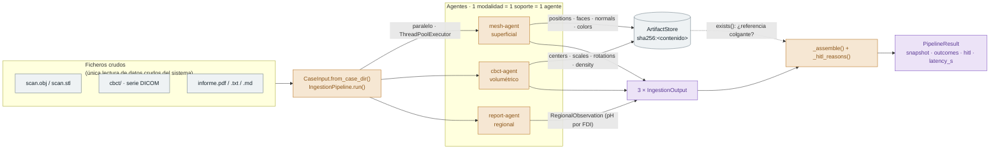
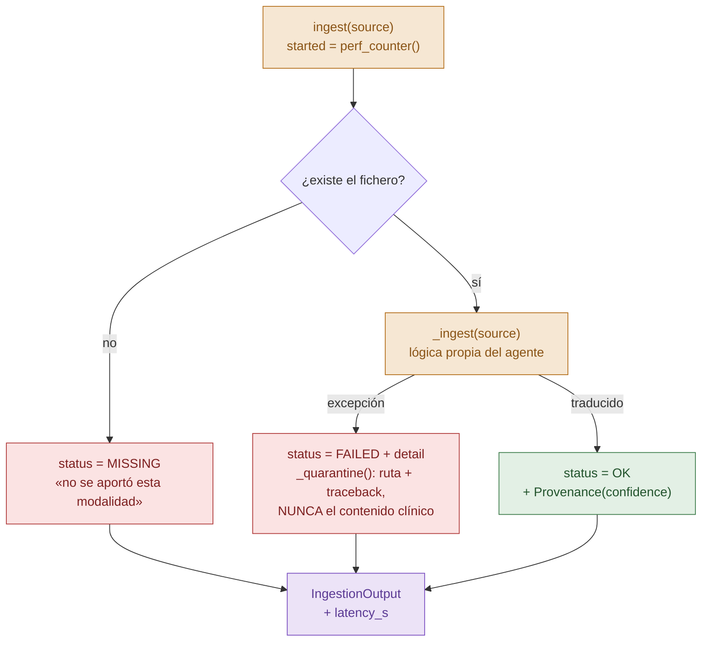
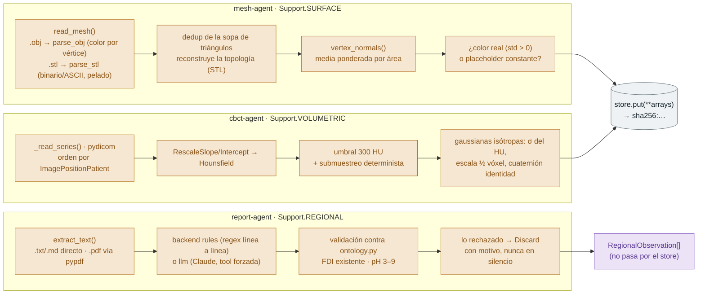
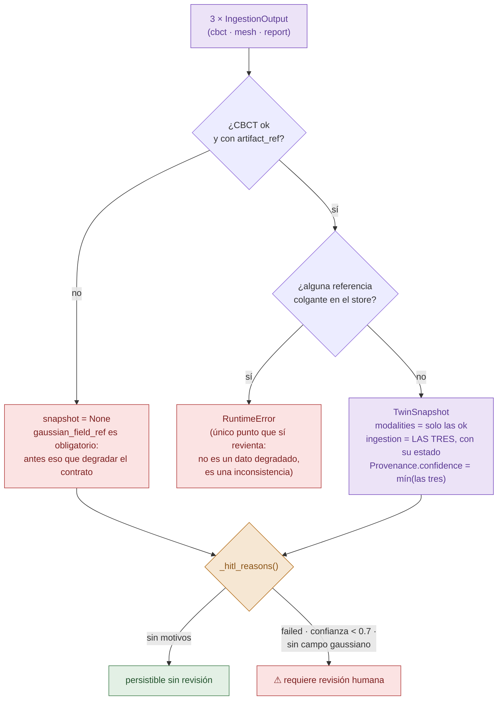

# `ingestion-agents` — Fase 1 del pipeline

Traducen **un** fichero clínico crudo a un fragmento del contrato de
[`core-schemas`](../core-schemas/). Regla del proyecto: **1 modalidad = 1 soporte
= 1 agente**. Son los **únicos** componentes que tocan ficheros crudos.

| Agente | Entrada | Soporte | Produce |
|---|---|---|---|
| `MeshAgent` | OBJ / STL intraoral | superficial | `surface_ref` — posiciones `float64`, caras, normales, color (el STL siempre va pelado) |
| `CBCTAgent` | directorio de serie DICOM | volumétrico | `gaussian_field_ref` — campo σ semilla |
| `ReportAgent` | PDF / TXT / MD | regional | `list[RegionalObservation]` — pH por FDI |

```python
from agent_orchestrator import CaseInput, IngestionPipeline
from ingestion_agents import ArtifactStore

pipeline = IngestionPipeline(ArtifactStore("data/interim/artifacts"))
result = pipeline.run(CaseInput.from_case_dir("data/interim/mi-caso"))

result.snapshot        # TwinSnapshot | None
result.hitl_required   # ¿necesita revisión humana?
result.latency_s       # métrica del brief: < 60 s
```

Demo de punta a punta con datos sintéticos (sin datos de paciente):

```bash
uv run python apps/agent-orchestrator/main.py --demo
```

---

## Flujo de una ingesta

### 1 · Vista de conjunto

De los ficheros crudos al contrato. El orquestador reparte, los agentes traducen,
el almacén guarda lo pesado y el contrato se ensambla al final.



Una modalidad **no aportada nunca llega al agente**: el orquestador la declara
`MISSING` él mismo. Es lo que impide confundir «no había CBCT» con «el CBCT
estaba roto» — dos situaciones con respuestas clínicas distintas.

El paralelismo es con **hilos**, no procesos: el trabajo real es I/O de disco y
numpy, que sueltan el GIL. Es lo que da margen al presupuesto de < 60 s del brief.

### 2 · El envoltorio *fail-loud* (lo que comparten los tres)

Ningún agente implementa esto: lo hereda de `BaseIngestionAgent.ingest()`. Las
subclases solo escriben `_ingest()`, y **pueden lanzar** — el envoltorio lo captura.



**No hay canal de excepción hacia el orquestador.** Los tres caminos terminan en
el mismo `IngestionOutput`; el fallo es un *dato* con motivo, no una excepción que
se lleve por delante las otras dos modalidades ([decisión 1](#1-un-fallo-es-un-dato-no-una-excepción)).

### 3 · Qué hace cada `_ingest()`

Misma forma de entrada y de salida, tres traducciones distintas. Ninguno decide
nada: solo traducen y declaran con qué confianza.



Detalles que el diagrama comprime y conviene no perder:

- El **orden de los cortes DICOM** no se deja al azar: un orden equivocado deforma
  el volumen **en silencio**.
- El **submuestreo del CBCT** es de paso uniforme, no aleatorio: la ingesta tiene
  que ser reproducible para poder medir la fiabilidad.
- El `report-agent` procesa **línea a línea** porque un informe dental enumera un
  hallazgo por línea; emparejar un pH con el diente de *su* línea evita colgar el
  valor del diente equivocado.
- El **campo gaussiano del CBCT es una semilla**, no una reconstrucción RGS: es la
  inicialización que un optimizador refinaría después.

### 4 · Del `IngestionOutput` al `TwinSnapshot`

El ensamblado y el gate humano viven en el orquestador, no en los agentes.



`modalities` lleva **solo las que salieron bien**; `ingestion` lleva **las tres
siempre**, con su estado. Es lo que hace que un snapshot parcial se declare
parcial en vez de llegar callado a exportación.

### Resumen: dónde vive cada responsabilidad

| Paso | Quién | Fichero |
|---|---|---|
| Descubrir modalidades del caso | orquestador | `pipeline.py` · `CaseInput.from_case_dir` |
| Declarar lo no aportado (`MISSING`) | orquestador | `pipeline.py` · `_missing` |
| Disparar en paralelo | orquestador | `pipeline.py` · `run` |
| Capturar fallos y poner en cuarentena | base compartida | `base.py` · `ingest` / `_quarantine` |
| Traducir la modalidad al contrato | cada agente | `mesh_agent.py` · `cbct_agent.py` · `report_agent.py` |
| Validar el vocabulario clínico | ontología | `ontology.py` |
| Persistir lo pesado por hash | almacén | `store.py` · `ArtifactStore.put` |
| Ensamblar el `TwinSnapshot` | orquestador | `pipeline.py` · `_assemble` |
| Decidir si hace falta una persona | orquestador | `pipeline.py` · `_hitl_reasons` |

La línea divisoria es siempre la misma: **los agentes traducen y declaran; el
orquestador reparte y decide.**

---

## Decisiones de diseño

### 1. Un fallo es un dato, no una excepción

`BaseIngestionAgent.ingest()` **nunca lanza**. Un DICOM corrupto devuelve
`status=FAILED` con el motivo, y el `TwinSnapshot` lo declara en su log de
`ingestion`. El motivo es concreto: las tres modalidades se ingieren en paralelo,
y si un fichero roto propagara la excepción se llevaría por delante las otras dos.
Además, un snapshot parcial que **se declara** parcial no puede llegar callado a
exportación.

`missing` (no se aportó el fichero) y `failed` (se aportó y no se pudo leer) son
estados distintos a propósito: sin esa distinción, «no hay malla» y «la malla
falló» serían el mismo silencio.

### 2. La decisión clínica vive en el orquestador, no en el agente

Los agentes reportan `Provenance.confidence`; **no** deciden qué se persiste. El
gate de human-in-the-loop es una regla explícita y auditable del
`IngestionPipeline` (umbral por defecto `0.7`). Separar *extracción* de *decisión*
es lo que mantiene la responsabilidad única y hace el gate revisable.

La confianza no es decorativa — se baja cuando la ingesta vale menos de lo que
parece:

| Situación | Confianza | Por qué |
|---|---|---|
| Malla con color por vértice real | 1.00 | aporte completo de la modalidad |
| Malla con color constante (placeholder) | 0.60 | el exportador escribió un gris, nadie midió apariencia |
| Malla sin color | 0.50 | falta el aporte propio de la modalidad |
| CBCT submuestreado por tope de primitivas | 0.90 | el campo es una submuestra, no el volumen |
| Informe del que no se extrae nada | 0.00 | puede ser un PDF escaneado sin OCR |

### 3. 🔒 Guardarraíl de reversibilidad en el `mesh-agent`

El brief exige regenerar el STL desde el twin con **< 0,1 mm** de error, y una
nube splatteada no llega (es lossy). Por eso el `mesh-agent` conserva la
**superficie de origen tal cual** — `float64` y topología de caras completa — en
vez de una versión remuestreada. El round-trip fichero → artefacto → fichero
tiene error **cero**, no «pequeño», y hay un test que lo mide contra el fichero
reparseado.

### 4. El gris de Teeth3DS+ no es color

Teeth3DS+ escribe `0.502` en los ~110k vértices de cada malla: es el
*placeholder* del exportador, no apariencia clínica. Persistirlo haría que la
fusión geométrica pintara las gaussianas con un color que nadie midió, así que un
color **constante** se trata igual que su ausencia (`color_superficie = None`),
bajando la confianza. Verificado sobre el dataset real, no sobre un fixture.

### 5. Referencias por contenido (SHA-256), no por ruta

Los blobs pesados van a un `ArtifactStore` direccionado por contenido. Dos
propiedades salen gratis: la referencia **es** una huella verificable de qué se
ingirió (trazabilidad), y reingerir el mismo escaneo no duplica gigabytes
(deduplicación). Se hashea nombre + dtype + shape + bytes de cada array, no el
`.npz` serializado: el ZIP lleva marcas de tiempo y el mismo contenido daría
hashes distintos.

Vive aquí y no en `packages/3dgs-engine/` porque el módulo de ese paquete
(`3dgs_engine`) **no es un identificador Python válido** — empieza por dígito — y
no se puede importar hasta renombrarlo. `ArtifactStore` es la interfaz que se
sustituirá cuando el motor exista.

### 6. Seudonimización en el borde

El `cbct-agent` deriva el `patient_id` del DICOM a un HMAC-SHA256 truncado
(`ASH_PSEUDONYM_SALT`). Es **estable** —el mismo paciente da el mismo seudónimo
entre adquisiciones, que es lo que permite montar su serie temporal— y no
reversible sin la sal. Es seudonimización, no anonimización: **la sal es el dato
a proteger**. La sal por defecto es de desarrollo y su nombre lo dice.

La cuarentena guarda **ruta + traceback**, nunca el contenido: mover un DICOM a
un directorio de cuarentena duplicaría dato de paciente fuera del almacenamiento
autorizado.

### 7. LLM solo donde la entrada no tiene esquema

Un DICOM y un OBJ son formatos: parsearlos es código tipado. Un informe es prosa.
Por eso el `report-agent` es el único con un backend LLM — y está **desactivado
por defecto**: `rules` (regex línea a línea) es determinista, corre en CI sin red
ni clave, y da el suelo medible contra el que comparar al LLM.

> ⚠ **Punto abierto.** La skill `add-ingestion-agent` §5 dice «no metas lógica de
> LLM: la ingesta es determinista». El backend `llm` existe porque un informe real
> en prosa libre no se parsea con regex, pero es opt-in y no afecta al camino por
> defecto. **Decisión pendiente del equipo**: mantenerlo aquí o sacarlo a un
> agente de extracción aparte.

### 8. Sin framework de agentes (todavía), y a propósito

En la ingesta no hay nada que un framework aporte: son tres tareas
**independientes**, con esquema fijo de entrada y salida y **sin enrutado
condicional**. Sus ventajas —grafo de decisión, estado compartido, replanificación—
presuponen decisiones que aquí no existen.

La elección (LangGraph / CrewAI / MCP / …) se toma donde sí empieza a haber grafo
—fusión ↔ segmentación ↔ análisis, con gates y reintentos— y **sin tocar los
agentes**: dependen del `Protocol` `IngestionAgent`, no del orquestador.

---

## Ontología clínica mínima

`ingestion_agents/ontology.py` — vocabulario controlado, no conocimiento clínico:

- **ISO-FDI (ISO 3950)**: qué códigos existen, su cuadrante, arcada, lado y tipo
  morfológico. Es el **ancla semántica** que une densidad, color y pH del mismo
  diente.
- **Rango plausible** de cada atributo regional. Es más estrecho que el del
  contrato **a propósito**: el contrato acota lo que es un pH (0–14); la ontología
  acota lo que es un pH *creíble en un informe dental* (3–9). Un `7.4` mal leído
  como `74` lo caza el contrato; un `1.2` lo caza esto.

## Datos sintéticos

`ingestion_agents/synthetic.py` genera un caso donde **las tres modalidades
describen la misma boca** — arcada parabólica de 16 dientes, materializada como
malla OBJ y como volumen DICOM, más el informe que cuelga el pH de algunos de
ellos. No es anatómicamente realista: es **coherente entre modalidades y
reproducible**, que es lo que la ingesta necesita validar (y lo que ningún
dataset público suelto da: nadie publica CBCT + malla + informe del mismo
paciente).

## Tests

```bash
uv run pytest -q --cov=ingestion_agents --cov=agent_orchestrator
```

Cobertura actual **96 %** (objetivo del brief: >80 %). Lo no cubierto es el
backend LLM y la lectura de PDF, ambos extras opcionales que requieren red o
dependencias fuera del entorno de CI.
