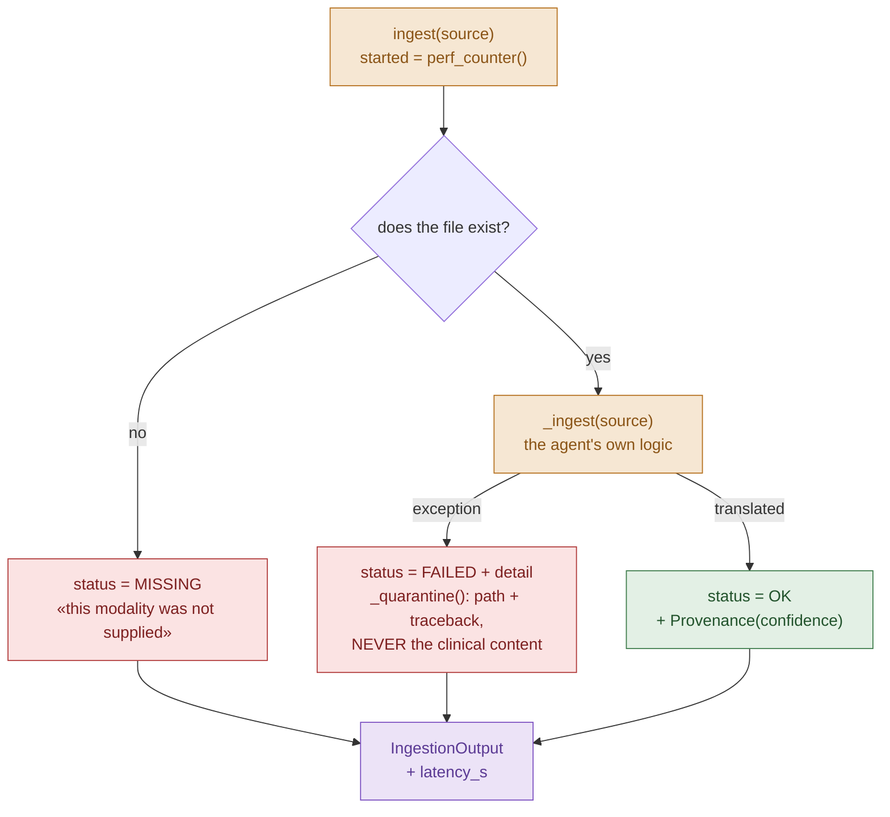
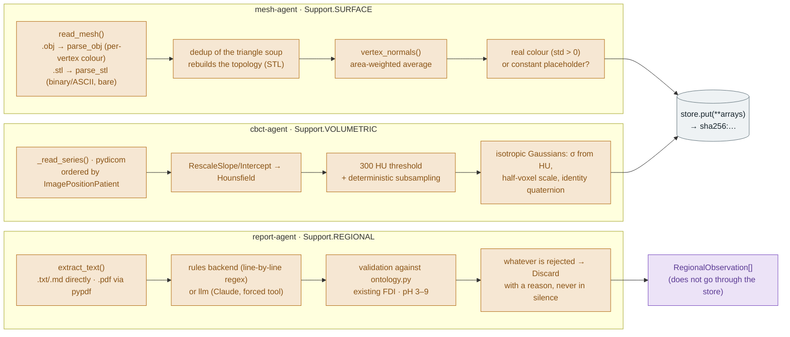
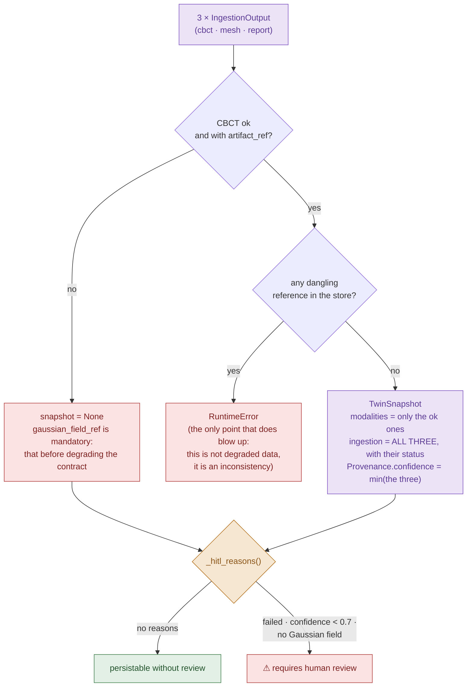

# `ingestion-agents` — Phase 1 of the pipeline

They translate **one** raw clinical file into a fragment of the
[`core-schemas`](../core-schemas/) contract. Project rule: **1 modality = 1 support
= 1 agent**. They are the **only** components that touch raw files.

| Agent | Input | Support | Produces |
|---|---|---|---|
| `MeshAgent` | intraoral OBJ / STL | surface | `surface_ref` — `float64` positions, faces, normals, colour (an STL always arrives bare) |
| `CBCTAgent` | DICOM series directory | volumetric | `gaussian_field_ref` — seed σ field |
| `ReportAgent` | PDF / TXT / MD | regional | `list[RegionalObservation]` — pH per FDI |

```python
from agent_orchestrator import CaseInput, IngestionPipeline
from ingestion_agents import ArtifactStore

pipeline = IngestionPipeline(ArtifactStore("data/interim/artifacts"))
result = pipeline.run(CaseInput.from_case_dir("data/interim/mi-caso"))

result.snapshot        # TwinSnapshot | None
result.hitl_required   # does it need human review?
result.latency_s       # brief metric: < 60 s
```

End-to-end demo with synthetic data (no patient data):

```bash
uv run python apps/agent-orchestrator/main.py --demo
```

---

## The flow of one ingestion

### 1 · Overview

From raw files to the contract. The orchestrator dispatches, the agents translate,
the store keeps the heavy things and the contract is assembled at the end.


A modality that was **not supplied never reaches the agent**: the orchestrator declares
it `MISSING` itself. That is what stops "there was no CBCT" being confused with "the
CBCT was broken" — two situations with different clinical answers.

Parallelism uses **threads**, not processes: the real work is disk I/O and numpy, which
release the GIL. That is what leaves headroom under the brief's < 60 s budget.

### 2 · The *fail-loud* wrapper (what the three share)

No agent implements this: it is inherited from `BaseIngestionAgent.ingest()`. Subclasses
only write `_ingest()`, and **they may raise** — the wrapper catches it.



**There is no exception channel towards the orchestrator.** All three paths end in the
same `IngestionOutput`; a failure is a *value* with a reason, not an exception that takes
the other two modalities down with it
([decision 1](#1-a-failure-is-data-not-an-exception)).

### 3 · What each `_ingest()` does

Same input and output shape, three different translations. None of them decides
anything: they only translate and declare with what confidence.



Details the diagram compresses and that are worth not losing:

- The **order of the DICOM slices** is not left to chance: a wrong order deforms the
  volume **silently**.
- **CBCT subsampling** uses a uniform stride, not randomness: ingestion has to be
  reproducible for reliability to be measurable.
- The `report-agent` processes **line by line** because a dental report lists one finding
  per line; pairing a pH with the tooth on *its* line avoids hanging the value off the
  wrong tooth.
- The **CBCT Gaussian field is a seed**, not an RGS reconstruction: it is the
  initialisation an optimiser would refine afterwards.

### 4 · From `IngestionOutput` to `TwinSnapshot`

Assembly and the human gate live in the orchestrator, not in the agents.



`modalities` carries **only the ones that went well**; `ingestion` carries **all three
always**, with their status. That is what makes a partial snapshot declare itself partial
instead of arriving at export in silence.

### Summary: where each responsibility lives

| Step | Who | File |
|---|---|---|
| Discover the case's modalities | orchestrator | `pipeline.py` · `CaseInput.from_case_dir` |
| Declare what was not supplied (`MISSING`) | orchestrator | `pipeline.py` · `_missing` |
| Fire in parallel | orchestrator | `pipeline.py` · `run` |
| Catch failures and quarantine | shared base | `base.py` · `ingest` / `_quarantine` |
| Translate the modality into the contract | each agent | `mesh_agent.py` · `cbct_agent.py` · `report_agent.py` |
| Validate the clinical vocabulary | ontology | `ontology.py` |
| Persist heavy data by hash | store | `store.py` · `ArtifactStore.put` |
| Assemble the `TwinSnapshot` | orchestrator | `pipeline.py` · `_assemble` |
| Decide whether a person is needed | orchestrator | `pipeline.py` · `_hitl_reasons` |

The dividing line is always the same: **agents translate and declare; the orchestrator
dispatches and decides.**

---

## Design decisions

### 1. A failure is data, not an exception

`BaseIngestionAgent.ingest()` **never raises**. A corrupt DICOM returns `status=FAILED`
with the reason, and the `TwinSnapshot` declares it in its `ingestion` log. The reason is
concrete: the three modalities are ingested in parallel, and if a broken file propagated
the exception it would take the other two down with it. On top of that, a partial
snapshot that **declares itself** partial cannot reach export in silence.

`missing` (the file was not supplied) and `failed` (it was supplied and could not be
read) are deliberately different states: without that distinction, "there is no mesh" and
"the mesh failed" would be the same silence.

### 2. The clinical decision lives in the orchestrator, not in the agent

Agents report `Provenance.confidence`; they do **not** decide what gets persisted. The
human-in-the-loop gate is an explicit, auditable rule of the `IngestionPipeline` (default
threshold `0.7`). Separating *extraction* from *decision* is what keeps the single
responsibility and makes the gate reviewable.

Confidence is not decorative — it is lowered when an ingestion is worth less than it
looks:

| Situation | Confidence | Why |
|---|---|---|
| Mesh with real per-vertex colour | 1.00 | full contribution from the modality |
| Mesh with constant colour (placeholder) | 0.60 | the exporter wrote a grey, nobody measured appearance |
| Mesh with no colour | 0.50 | the modality's own contribution is missing |
| CBCT subsampled by a primitive cap | 0.90 | the field is a subsample, not the volume |
| Report from which nothing is extracted | 0.00 | it may be a scanned PDF with no OCR |

### 3. 🔒 Reversibility guardrail in the `mesh-agent`

The brief requires regenerating the STL from the twin with **< 0.1 mm** of error, and a
splatted cloud does not get there (it is lossy). That is why the `mesh-agent` keeps the
**source surface as it is** — `float64` and complete face topology — instead of a
resampled version. The file → artifact → file round trip has **zero** error, not "small",
and there is a test that measures it against the reparsed file.

### 4. The Teeth3DS+ grey is not colour

Teeth3DS+ writes `0.502` into the ~110k vertices of every mesh: it is the exporter's
*placeholder*, not clinical appearance. Persisting it would make geometric fusion paint
the Gaussians with a colour nobody measured, so a **constant** colour is treated the same
as its absence (`color_superficie = None`), lowering the confidence. Verified against the
real dataset, not against a fixture.

### 5. References by content (SHA-256), not by path

Heavy blobs go to a content-addressed `ArtifactStore`. Two properties come for free: the
reference **is** a verifiable fingerprint of what was ingested (traceability), and
re-ingesting the same scan does not duplicate gigabytes (deduplication). What is hashed
is name + dtype + shape + bytes of each array, not the serialised `.npz`: the ZIP carries
timestamps and the same content would yield different hashes.

It lives here and not in `packages/3dgs-engine/` because that package's module
(`3dgs_engine`) **is not a valid Python identifier** — it starts with a digit — and
cannot be imported until it is renamed. `ArtifactStore` is the interface that will be
replaced once the engine exists.

### 6. Pseudonymisation at the edge

The `cbct-agent` derives the DICOM `patient_id` into a truncated HMAC-SHA256
(`ASH_PSEUDONYM_SALT`). It is **stable** — the same patient yields the same pseudonym
across acquisitions, which is what makes their time series possible — and not reversible
without the salt. This is pseudonymisation, not anonymisation: **the salt is the thing to
protect**. The default salt is a development one and its name says so.

Quarantine stores **path + traceback**, never the content: moving a DICOM into a
quarantine directory would duplicate patient data outside the authorised storage.

### 7. LLM only where the input has no schema

A DICOM and an OBJ are formats: parsing them is typed code. A report is prose. That is
why the `report-agent` is the only one with an LLM backend — and it is **disabled by
default**: `rules` (line-by-line regex) is deterministic, runs in CI with no network and
no key, and gives the measurable floor to compare the LLM against.

> ⚠ **Open point.** The `add-ingestion-agent` skill §5 says "do not put LLM logic in:
> ingestion is deterministic". The `llm` backend exists because a real free-prose report
> cannot be parsed with regex, but it is opt-in and does not affect the default path.
> **Pending team decision**: keep it here or move it out into a separate extraction
> agent.

### 8. No agent framework (yet), and on purpose

There is nothing in ingestion that a framework would add: these are three
**independent** tasks, with a fixed input and output schema and **no conditional
routing**. A framework's advantages — decision graph, shared state, replanning —
presuppose decisions that do not exist here.

The choice (LangGraph / CrewAI / MCP / …) is made where a graph does start to appear
— fusion ↔ segmentation ↔ analysis, with gates and retries — and **without touching the
agents**: they depend on the `IngestionAgent` `Protocol`, not on the orchestrator.

---

## Minimal clinical ontology

`ingestion_agents/ontology.py` — controlled vocabulary, not clinical knowledge:

- **ISO-FDI (ISO 3950)**: which codes exist, their quadrant, arch, side and morphological
  type. It is the **semantic anchor** that ties together density, colour and pH of the
  same tooth.
- **Plausible range** for each regional attribute. It is narrower than the contract's
  **on purpose**: the contract bounds what a pH is (0–14); the ontology bounds what a
  *credible pH in a dental report* is (3–9). A `7.4` misread as `74` is caught by the
  contract; a `1.2` is caught by this.

## Synthetic data

`ingestion_agents/synthetic.py` generates a case where **the three modalities describe
the same mouth** — a parabolic 16-tooth arch, materialised as an OBJ mesh and as a DICOM
volume, plus the report that hangs a pH off some of them. It is not anatomically
realistic: it is **cross-modality coherent and reproducible**, which is what ingestion
needs to validate (and what no loose public dataset provides: nobody publishes CBCT +
mesh + report for the same patient).

## Report evaluation corpus

`ingestion_agents/report_corpus.py` is to reports what `edge_cases.py` is to broken
inputs: a single catalogue, 22 synthetic reports, each one with **what it actually says**
annotated by hand and **what the deterministic backend gets out of it** today. The two
columns are separated on purpose — if the reference were whatever the regex extracts, the
regex would score 100% by definition and there would be no floor to compare an LLM
against.

```bash
uv run python scripts/eval_informes.py --detalle     # deterministic backend
uv run python scripts/eval_informes.py --backend llm # requires ANTHROPIC_API_KEY
```

Measured over the corpus (22 reports · 19 pH values · 47 clinical · 5 indices):

| family | `rules` coverage | false values |
|---|---|---|
| tabular (8 reports) | **97.8%** | 0 |
| prose (7 reports) | **43.5%** | 2 |
| abstention (7 reports) | 100% | 1 |
| **total** | **80.3%** | **3** |

Two readings, and the second matters more than the first:

1. The deterministic backend **meets the brief's >95% on the ground it was written for**
   (tabular) and drops to 43% on prose. The global 78.8% figure is not a verdict on the
   extractor: it is the proportion of each format in the corpus. That is why it is
   reported per family.
2. There are **3 false values** inside the contract, and they are a different failure
   from the gap. The worst: `Tooth #14` (Universal notation, which is 26 in FDI) is
   ingested as FDI 14 — a different tooth — with confidence 0.9 and no discard to give it
   away. All three are pinned in
   `test_corpus_informes.py::FALSOS_POSITIVOS_RULES`, a number that can only go down.

The corpus was not written to give the current extractor a pass, but to give the `llm`
backend something to measure itself against. And it already served for that: measuring
this table is what exposed that the LLM only produced pH — the field the regex already
covers at 98% — while the prose fields came out of the regex even with `backend="llm"`.
Both backends cover the same fields today, so `--backend llm` is comparable value by
value.

## Tests

```bash
uv run pytest -q --cov=ingestion_agents --cov=agent_orchestrator
```

Current coverage **96%** (brief target: >80%). What is not covered is the LLM backend and
PDF reading, both optional extras that require network or dependencies outside the CI
environment.
